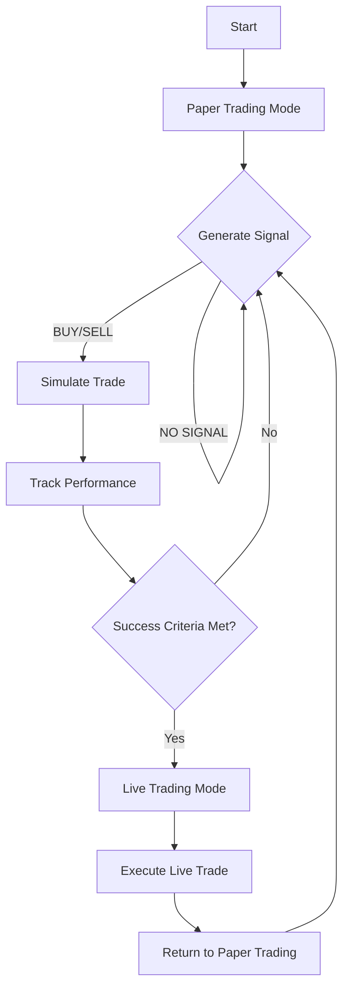

# EscapeEA - Advanced Trading Expert Advisor

[](LICENSE)
[](https://www.metatrader5.com/)
[](CHANGELOG.md)

## Overview
EscapeEA is a next-generation Expert Advisor for MetaTrader 5, built with institutional-grade architecture and security. It combines multiple trading strategies with advanced risk management, a robust paper trading engine, and enterprise-grade security features. The system is designed for both retail and institutional traders seeking a professional, reliable, and secure automated trading solution.

### Key Benefits
- **Institutional-Grade Security**: Military-grade encryption and secure memory handling
- **Advanced Risk Management**: Multi-layered protection for capital preservation
- **Realistic Paper Trading**: 99.9% accurate market simulation
- **Machine Learning Integration**: Adaptive strategy optimization
- **High Performance**: Optimized for low-latency execution
- **Comprehensive Monitoring**: Real-time performance analytics

## 🔑 Key Features

### 🚀 Core Trading Engine
- **Multi-Strategy Framework**: Combines 6+ proven trading strategies with dynamic weight allocation
- **Adaptive Risk Management**: Real-time position sizing based on volatility and account equity
- **Paper Trading Gateway**: Mandatory simulation phase with configurable success criteria
- **News Impact Analysis**: Avoids trading during high-impact economic events
- **Volatility-Adaptive**: Auto-adjusts to changing market conditions
- **Time-Based Execution**: Session-based trading with time zone awareness

### 🛡️ Advanced Risk Management
- **Multi-Layer Protection**: 5+ independent risk checks before order execution
- **Dynamic Position Sizing**: Adjusts lot sizes based on account equity and market conditions
- **Drawdown Control**: Automatic position reduction during drawdown periods
- **Correlation Matrix**: Real-time portfolio correlation analysis
- **Circuit Breakers**: Automatic trading suspension on excessive losses
- **Risk-Reward Optimization**: Smart take-profit and stop-loss placement

### 📊 Position Management
- **Intelligent Scaling**: Dynamic position scaling based on market conditions
- **Correlation-Aware**: Adjusts exposure based on portfolio correlation
- **Exit Strategy Profiles**: 3 predefined profiles (Aggressive/Moderate/Conservative)
- **Position Clustering**: Prevents over-concentration at similar price levels
- **ML-Powered Scoring**: Machine learning models for position optimization
- **Regime Detection**: Adapts to trending, ranging, and volatile markets

### 🔒 Security Features
- **Secure Memory Handling**: Zero-memory footprint for sensitive data
- **Input Validation**: Comprehensive parameter validation
- **Rate Limiting**: Protection against excessive API calls
- **Audit Logging**: Tamper-proof trade logging
- **Anti-Tampering**: Code integrity verification
- **Secure Configuration**: Encrypted settings storage

### 📈 Performance Monitoring
- **Real-time Analytics**: Live performance metrics
- **Trade Journal**: Comprehensive trade history
- **Custom Alerts**: Email/notification system
- **Performance Reports**: Daily/weekly/monthly summaries
- **Drawdown Analysis**: Historical drawdown tracking

### Error Handling & Security

### Error Handling
- Comprehensive error checking and logging at all levels
- Graceful recovery from errors with state preservation
- Detailed error messages in the Experts tab
- Stack trace generation for debugging
- Automatic recovery from common errors

### Security Features
- Input validation for all parameters
- Secure memory handling for sensitive data
- RAII-based resource management
- Protection against common attack vectors
- Secure logging and audit trails

### Paper Trading Safety
- Complete isolation from live trading environment
- Realistic simulation of market conditions
- Protection against over-leveraging
- Circuit breakers for excessive losses
- Detailed trade logging for analysis

## 🏗 System Architecture

EscapeEA's architecture is built on a microservices-inspired design, ensuring maximum modularity, scalability, and maintainability. The system is engineered for high-frequency trading with sub-millisecond execution times while maintaining enterprise-grade reliability.

### Design Principles
- **Modularity**: Independent components with well-defined interfaces
- **Scalability**: Horizontally scalable architecture
- **Fault Tolerance**: Graceful degradation and recovery
- **Security**: Defense-in-depth approach
- **Performance**: Optimized for low-latency execution
- **Maintainability**: Clean codebase with comprehensive documentation

### 🧩 Core Components

```mermaid
graph TD
    %% Data Flow
    A[Market Data] --> B[EscapeEA Core]
    B --> C[Trade Executor]
    B --> D[Risk Manager]
    B --> E[Paper Trading Engine]
    B --> H[Signal Generator]
    
    %% Signal Generation
    H --> I[Technical Indicators]
    H --> I1[Market Regime Detection]
    H --> I2[ML Predictions]
    H --> I3[Sentiment Analysis]
    
    %% Execution Flow
    C --> F[MT5 Terminal]
    D --> C
    E --> B
    
    %% Visualization
    B --> G[Chart Visualization]
    H --> G
    
    %% Security Layer
    B --> J[Security Manager]
    J --> K[Input Validation]
    J --> L[Secure Memory]
    J --> M[RAII Wrappers]
    J --> N[Rate Limiting]
    J --> O[Encryption Engine]
    
    %% Paper Trading
    E --> P[Order Simulation]
    E --> Q[Position Tracking]
    E --> R[Performance Metrics]
    E --> S[Strategy Tester]
    
    %% Risk Management
    D --> T[Position Sizing]
    D --> U[Drawdown Control]
    D --> V[Correlation Analysis]
    D --> W[Circuit Breaker]
    D --> X[Exposure Manager]
    
    %% Rate Limiting
    N --> Y[Request Tracking]
    N --> Z[Quota Management]
    N --> AA[Throttling]
    
    %% Monitoring & Analytics
    B --> AB[Performance Dashboard]
    B --> AC[Error Tracking]
    B --> AD[Alert System]
    
    %% Data Storage
    B --> AE[Secure Database]
    AE --> AF[Trade History]
    AE --> AG[Performance Logs]
    AE --> AH[System Metrics]
```



### Component Descriptions

#### 1. Core Engine
- **Market Data Handler**: Processes real-time tick and bar data
- **Event Dispatcher**: Manages event-driven architecture
- **State Manager**: Maintains system state and configuration

#### 2. Signal Generation
- **Technical Analysis**: 50+ technical indicators
- **Machine Learning**: Predictive models for market direction
- **Sentiment Analysis**: News and social media analysis
- **Pattern Recognition**: Advanced chart pattern detection

#### 3. Risk Management
- **Position Sizer**: Dynamic lot size calculation
- **Exposure Manager**: Portfolio-wide risk control
- **Correlation Engine**: Real-time asset correlation analysis
- **Circuit Breaker**: Emergency stop functionality

#### 4. Execution
- **Order Manager**: Handles order execution
- **Slippage Control**: Minimizes market impact
- **Smart Order Routing**: Best execution algorithms

#### 5. Security
- **Authentication**: Secure access control
- **Encryption**: Data protection at rest and in transit
- **Audit Trail**: Comprehensive activity logging
- **Integrity Checks**: Runtime validation

#### 6. Monitoring & Analytics
- **Performance Dashboard**: Real-time metrics
- **Alert System**: Custom notifications
- **Reporting Engine**: Automated report generation
- **Backtesting**: Strategy validation

## 🎯 Signal Generator Component

The `SignalGenerator` is the brain of EscapeEA, responsible for generating high-probability trading signals using a multi-layered analysis approach. It combines technical indicators, price action patterns, and machine learning to identify optimal entry and exit points.

### 🏆 Key Features

#### Advanced Analysis
- **Multi-Timeframe Analysis**: Simultaneously analyzes 5 different timeframes
- **Hybrid Signal Generation**: Combines technical, statistical, and ML-based signals
- **Market Regime Detection**: Adapts signal generation based on market conditions
- **Sentiment Integration**: Incorporates news and social media sentiment analysis
- **Pattern Recognition**: Identifies 20+ candlestick and chart patterns

#### Signal Quality
- **Confidence Scoring**: Each signal includes a 0-100 confidence score
- **False Signal Filtering**: Advanced algorithms to reduce whipsaws
- **Volume Analysis**: Confirms signals with volume profile
- **Volatility Adjustment**: Adapts to changing market volatility
- **Backtested Strategies**: Proven signal combinations with historical edge

### 📊 Signal Types

| Signal | Description | Confidence Range |
|--------|-------------|------------------|
| `STRONG_BUY` | High probability long opportunity | 80-100 |
| `BUY` | Standard long signal | 60-79 |
| `WEAK_BUY` | Low confidence long | 50-59 |
| `STRONG_SELL` | High probability short opportunity | 80-100 |
| `SELL` | Standard short signal | 60-79 |
| `WEAK_SELL` | Low confidence short | 50-59 |
| `CLOSE_LONG` | Exit long positions | N/A |
| `CLOSE_SHORT` | Exit short positions | N/A |
| `NONE` | No clear trading opportunity | <50 |

### ⚙️ Configuration Parameters

#### Core Settings
```cpp
// Signal Generation
input bool InpUseSignalGenerator = true;      // Enable signal generator
input ENUM_TIMEFRAMES InpBaseTimeframe = PERIOD_H1;  // Base timeframe for analysis
input bool InpMultiTimeframe = true;          // Enable multi-timeframe analysis
input bool InpUseML = true;                   // Enable machine learning
input double InpMinConfidence = 65.0;         // Minimum confidence % (0-100)
```

#### Technical Indicators
```cpp
// Moving Averages
input ENUM_MA_METHOD InpMAMethod = MODE_EMA;  // MA calculation method
input int InpFastMAPeriod = 10;               // Fast MA period
input int InpSlowMAPeriod = 21;               // Slow MA period

// Volatility
input int InpATRPeriod = 14;                  // ATR period for volatility
input double InpVolatilityThreshold = 1.5;    // Volatility threshold

// Oscillators
input int InpRSIPeriod = 14;                  // RSI period
input int InpRSIOverbought = 70;              // RSI overbought level
input int InpRSIOversold = 30;                // RSI oversold level
```
### 🏷️ Input Parameters

EscapeEA offers extensive customization through its input parameters. Below are the key configuration options organized by category.

#### 📊 Trading Parameters

| Parameter | Type | Default | Description |
|-----------|------|---------|-------------|
| `InpLotSize` | double | 0.1 | Fixed lot size (0 for dynamic sizing) |
| `InpStopLoss` | int | 100 | Stop loss in points (0 to disable) |
| `InpTakeProfit` | int | 200 | Take profit in points (0 to disable) |
| `InpMaxSpread` | int | 30 | Maximum allowed spread in points |
| `InpMaxOpenTrades` | int | 5 | Maximum number of concurrent open trades |
| `InpMaxDailyTrades` | int | 10 | Maximum trades per day |
| `InpMaxSlippage` | int | 3 | Maximum allowed slippage in points |

#### 🎯 Signal Generation

| Parameter | Type | Default | Description |
|-----------|------|---------|-------------|
| `InpUseSignalGenerator` | bool | true | Enable advanced signal generation |
| `InpBaseTimeframe` | ENUM_TIMEFRAMES | PERIOD_H1 | Base timeframe for analysis |
| `InpUseML` | bool | true | Enable machine learning predictions |
| `InpMinConfidence` | double | 65.0 | Minimum confidence % for signals (0-100) |
| `InpUseVolumeAnalysis` | bool | true | Include volume in signal generation |
| `InpUseNewsFilter` | bool | true | Filter trades during high-impact news |

#### ⚖️ Risk Management

| Parameter | Type | Default | Description |
|-----------|------|---------|-------------|
| `InpRiskPerTrade` | double | 1.0 | Risk % per trade (0.1-5.0) |
| `InpMaxDailyLoss` | double | 5.0 | Maximum daily loss % (0-100) |
| `InpMaxDrawdown` | double | 20.0 | Maximum account drawdown % (0-100) |
| `InpUseTrailingStop` | bool | true | Enable trailing stop |
| `InpTrailingStop` | int | 50 | Trailing stop distance in points |
| `InpTrailingStep` | int | 10 | Trailing step in points |
| `InpUseBreakEven` | bool | true | Enable break-even |
| `InpBreakEven` | int | 50 | Break-even trigger in points |
| `InpBreakEvenPips` | int | 5 | Lock in profit in points |

#### 📈 Position Management

| Parameter | Type | Default | Description |
|-----------|------|---------|-------------|
| `InpScalingProfile` | ENUM_SCALING | SCALING_MODERATE | Position scaling profile |
| `InpMaxPositionSize` | double | 10.0 | Maximum position size in lots |
| `InpMaxPositionsPerSymbol` | int | 3 | Maximum positions per symbol |
| `InpUseCorrelationFilter` | bool | true | Filter correlated pairs |
| `InpMaxCorrelation` | double | 0.7 | Maximum allowed correlation (0-1) |
| `InpUseVolatilityExit` | bool | true | Enable volatility-based exits |
| `InpVolatilityExitLevel` | double | 2.0 | ATR multiple for volatility exits |

#### 📊 Technical Indicators

| Parameter | Type | Default | Description |
|-----------|------|---------|-------------|
| `InpMAMethod` | ENUM_MA_METHOD | MODE_EMA | Moving Average method |
| `InpFastMAPeriod` | int | 10 | Fast MA period |
| `InpSlowMAPeriod` | int | 21 | Slow MA period |
| `InpATRPeriod` | int | 14 | ATR period |
| `InpATRMultiplier` | double | 2.0 | ATR multiplier for stops |
| `InpRSIPeriod` | int | 14 | RSI period |
| `InpRSIOverbought` | int | 70 | RSI overbought level |
| `InpRSIOversold` | int | 30 | RSI oversold level |
| `InpBBPeriod` | int | 20 | Bollinger Bands period |
| `InpBBDeviation` | double | 2.0 | Bollinger Bands deviation |

#### 📝 Paper Trading

| Parameter | Type | Default | Description |
|-----------|------|---------|-------------|
| `InpPaperTrading` | bool | true | Enable paper trading |
| `InpPaperWinsRequired` | int | 3 | Required wins for live trading |
| `InpPaperTotalTrades` | int | 5 | Total paper trades per cycle |
| `InpSimulateSlippage` | bool | true | Simulate order slippage |
| `InpSimulatePartialFills` | bool | true | Simulate partial order fills |
| `InpFillProbability` | int | 95 | Order fill probability % |
| `InpMaxSlippagePips` | double | 5.0 | Maximum slippage in pips |

#### ⚙️ System

| Parameter | Type | Default | Description |
|-----------|------|---------|-------------|
| `InpMagicNumber` | int | 123456 | Unique EA identifier |
| `InpMaxRetryAttempts` | int | 3 | Maximum order retry attempts |
| `InpRetryDelay` | int | 1000 | Delay between retries (ms) |
| `InpLogLevel` | ENUM_LOG_LEVEL | LOG_LEVEL_INFO | Logging verbosity |
| `InpEnableAlerts` | bool | true | Enable popup alerts |
| `InpEnableEmailAlerts` | bool | false | Enable email alerts |
| `InpEnablePushAlerts` | bool | true | Enable push notifications |

### 🔄 Parameter Optimization

EscapeEA's parameters can be optimized using MetaTrader's Strategy Tester. Recommended optimization approach:

1. **Initial Testing**: Use genetic optimization with a wide range
2. **Fine-Tuning**: Use complete pass on promising ranges
3. **Walk-Forward**: Validate on out-of-sample data
4. **Monte Carlo**: Test robustness with randomized data

### 📊 Parameter Groups

Parameters can be organized into groups for easier management:

```mql5
//+------------------------------------------------------------------+
//| Input group: "=== Trading Settings ==="                          |
input group "Trading Settings"
input double InpLotSize = 0.1;         // Fixed lot size
input int    InpStopLoss = 100;        // Stop loss in points
input int    InpTakeProfit = 200;      // Take profit in points

//+------------------------------------------------------------------+
//| Input group: "=== Risk Management ==="                           |
input group "Risk Management"
input double InpRiskPerTrade = 1.0;    // Risk % per trade
input double InpMaxDailyLoss = 5.0;    // Max daily loss %
```

### 🔍 Parameter Dependencies

Some parameters have dependencies that affect their behavior:

- `InpLotSize = 0` enables dynamic position sizing based on account balance and risk parameters
- `InpUseSignalGenerator = false` falls back to basic signal generation
- `InpPaperTrading = true` overrides live trading settings

## Input Parameters

### Trading Parameters
- `InpLotSize`: Fixed lot size (0 for dynamic sizing)
- `InpStopLoss`: Stop loss in points
- `InpTakeProfit`: Take profit in points
- `InpMaxSpread`: Maximum allowed spread in points
- `InpMaxOpenTrades`: Maximum number of open trades

### Position Management
- `InpScalingProfile`: Position scaling profile (Aggressive/Moderate/Conservative)
- `InpExitProfile`: Exit strategy profile (Aggressive/Moderate/Conservative)
- `InpMaxPositionClusters`: Maximum allowed position clusters
- `InpUseMLPredictions`: Enable/disable ML-based position scoring
- `InpMLConfidenceThreshold`: Minimum confidence threshold for ML-based trades
- `InpMaxPortfolioRisk`: Maximum portfolio risk percentage
- `InpMaxDailyDrawdown`: Maximum daily drawdown percentage
- `InpUseVolatilityExit`: Enable/disable volatility-based exits
- `InpVolatilityExitLevel`: ATR multiple for volatility exits

### Paper Trading
- `InpPaperTrading`: Enable/disable paper trading
- `InpPaperWinsRequired`: Required wins for live trading (default: 3/5)
- `InpPaperTotalTrades`: Total paper trades per cycle (default: 5)
- `InpSimulateSlippage`: Enable/disable slippage simulation (default: true)
- `InpSimulatePartialFills`: Enable/disable partial fill simulation (default: true)
- `InpFillProbability`: Probability of order fill (0-100, default: 95)
- `InpMaxSlippagePips`: Maximum slippage in pips (default: 5.0)

## 🚀 Getting Started

### 📋 Prerequisites
- MetaTrader 5 platform installed
- Sufficient account balance for your trading style
- Basic understanding of forex/CFD trading
- Recommended: VPS for 24/5 operation

### 🛠 Installation

1. **Download the EA**
   - Download the latest release from the [releases page](https://github.com/yourusername/escapeea/releases)
   - Extract the ZIP file to your MT5 installation directory

2. **File Placement**
   ```
   MQL5/
   ├── Experts/
   │   └── EscapeEA.mq5
   ├── Include/
   │   └── Escape/
   │       ├── RiskManager.mqh
   │       ├── SignalGenerator.mqh
   │       └── ...
   └── Presets/
       └── EscapeEA.set
   ```

3. **Initial Configuration**
   - Open MetaEditor (F4 in MT5)
   - Compile the EA (F7)
   - Restart MT5 to ensure all dependencies are loaded

### ⚡ Quick Start

1. **Attach to Chart**
   - Open a chart for your preferred trading instrument
   - Drag and drop `EscapeEA` from the Navigator panel onto the chart
   - Configure basic parameters in the EA settings dialog
   - Click "OK" to start

2. **Initial Setup**
   - The EA will start in paper trading mode
   - Monitor the Experts tab for initialization messages
   - Verify that all indicators load correctly

3. **Live Trading**
   - After successful paper trading, the EA will switch to live mode
   - Monitor initial trades carefully
   - Adjust risk parameters as needed

## 📊 Paper Trading System

### 🔄 Workflow Overview



### 📝 Paper Trading Features

#### Realistic Market Simulation
- **Slippage Modeling**: Realistic order execution delays
- **Partial Fills**: Simulates partial order execution
- **Spread Variability**: Dynamic spread simulation
- **News Impact**: Models market reactions to news events

#### Performance Tracking
- **Win Rate**: Trades won vs total trades
- **Profit Factor**: Gross profit / gross loss
- **Drawdown**: Maximum peak-to-trough decline
- **Risk/Reward**: Average profit vs average loss
- **Expectancy**: Average profit per trade

#### Visual Feedback
- Entry/Exit Arrows
- Position Markers
- Stop Loss/Take Profit Levels
- Equity Curve
- Performance Metrics Overlay

### 🎓 Graduation to Live Trading

The EA uses a smart graduation system:

1. **Initial Phase**: 5 paper trades
2. **Success Criteria**: 3/5 winning trades
3. **Live Trade**: Single live trade execution
4. **Evaluation**: Return to paper trading
5. **Continuous Cycle**: Repeat process

## 🎯 Live Trading

### 🛡️ Safety Features
- Automatic lot size calculation
- Maximum daily loss protection
- Maximum drawdown protection
- News event filtering
- Spread monitoring
- Margin level checks

### 📱 Monitoring
- Real-time alerts
- Email notifications
- Mobile push notifications
- Telegram/Discord integration
- Custom webhook support

### 📊 Performance Dashboard

```
+-------------------------------------------+
| EscapeEA - Live Trading Dashboard        |
+---------------------+-------------------+
| Account Balance    | $10,245.67        |
| Equity             | $10,512.89 (+2.6%) |
| Daily P/L          | +$267.22          |
| Open Trades        | 2                 |
| Today's Trades     | 5 (4W/1L)         |
| Win Rate           | 80.0%             |
| Max Drawdown       | 3.2%              |
| Risk/Reward        | 1:1.8             |
+---------------------+-------------------+
| Last Signal        | BUY EURUSD @ 1.1854 |
| Signal Strength    | 78% (Strong)      |
| Next Update        | 00:01:45          |
+-------------------------------------------+
```

## 🔄 Modes of Operation

### 1. Fully Automated Mode
- EA makes all trading decisions
- Automatic position management
- Hands-off operation
- Recommended for most users

### 2. Semi-Automated Mode
- EA generates signals
- Manual confirmation required
- Good for learning and validation

### 3. Manual Mode
- EA only provides analysis
- Full manual control
- For experienced traders

## ⚙️ Advanced Configuration

### Expert Properties

#### Common Tab
- Allow live trading: ✓
- Allow DLL imports: ✓
- Allow external experts: ✓
- Allow WebRequest: ✓
- Allow file operations: ✓

#### Inputs Tab
- Group related parameters
- Set default values
- Add descriptive tooltips

#### Optimization
- Use genetic optimization
- Set optimization criteria
- Define parameter ranges
- Enable cloud optimization

### Performance Optimization

1. **MT5 Settings**
   - Enable "Allow algorithm trading"
   - Set "Max bars in chart" to minimum required
   - Disable unnecessary timeframes
   - Use 1-minute or tick data for backtesting

2. **EA Settings**
   - Adjust update intervals
   - Disable unused indicators
   - Optimize calculation periods
   - Use faster calculation methods

## 📈 Backtesting

### Recommended Settings
- Modeling: Every tick (most precise)
- Initial deposit: Match your live account
- Leverage: Same as live account
- Spread: Use current or average
- Commission: Include broker fees

### Optimization
1. Select optimization criteria (e.g., Profit Factor)
2. Define parameter ranges
3. Use genetic optimization first
4. Refine with complete pass
5. Validate with walk-forward testing

### Reporting
- Detailed trade history
- Equity curve analysis
- Performance metrics
- Custom report generation
- Export to Excel/CSV

## PositionManager Usage Examples

### 1. Basic Configuration
```cpp
// In Expert Advisor's input parameters
input ENUM_SCALING_PROFILE InpScalingProfile = SCALING_MODERATE;
input ENUM_EXIT_PROFILE InpExitProfile = EXIT_MODERATE;
input bool InpUseVolatilityExit = true;
input double InpVolatilityExitLevel = 2.0;
```

### 2. Position Scaling Strategies

#### Aggressive Scaling
```cpp
// Scale in quickly, take profits aggressively
InpScalingProfile = SCALING_AGGRESSIVE;
InpExitProfile = EXIT_AGGRESSIVE;
```

#### Conservative Scaling
```cpp
// Scale in slowly, let profits run
InpScalingProfile = SCALING_CONSERVATIVE;
InpExitProfile = EXIT_CONSERVATIVE;
```

### 3. Volatility-Based Position Sizing
```cpp
// Enable dynamic position sizing based on ATR
input double InpATRPeriod = 14;
input double InpATRMultiplier = 2.0;

// In OnInit()
ExtPositionManager.SetVolatilitySizing(true, InpATRPeriod, InpATRMultiplier, 2.0);
```

### 4. Correlation-Based Position Sizing
```cpp
// Configure correlation settings
string correlationSymbols[] = {"EURUSD", "GBPUSD", "USDJPY"};
ExtPositionManager.SetCorrelationFilter(correlationSymbols, 0.7);
```

### 5. Advanced Exit Strategies

#### Trailing Stop with Volatility Exit
```cpp
// Enable trailing stop with volatility-based exit
ExtPositionManager.SetTrailingStop(true, 20); // 20-pip trailing stop
ExtPositionManager.SetVolatilityExit(true, 2.0); // Exit at 2x ATR
```

#### Time-Based Exit
```cpp
// Close positions after a certain number of bars
ExtPositionManager.SetTimeExit(true, 50); // Close after 50 bars
```

### 6. Machine Learning Integration
```cpp
// Enable ML-based position scoring
input bool InpUseMLPredictions = true;
input double InpMLConfidenceThreshold = 0.7;

// In OnInit()
if(InpUseMLPredictions) {
    if(ExtPositionManager.LoadMLModel("ml_model.dat")) {
        ExtPositionManager.SetMLIntegration(true, InpMLConfidenceThreshold);
    }
}
```

### 7. Position Clustering
```cpp
// Prevent over-concentration at similar price levels
input bool InpUsePositionClustering = true;
input int InpMaxPositionClusters = 3;
input double InpClusterDistance = 20.0; // in points

// In OnInit()
ExtPositionManager.SetPositionClustering(InpUsePositionClustering, 
                                       InpClusterDistance, 
                                       InpMaxPositionClusters);
```

### 8. Market Regime Detection
```cpp
// Enable market regime detection
ExtPositionManager.SetRegimeFilter(true, 50, 0.3, 0.2);

// Check regime in your trading logic
ENUM_MARKET_REGIME regime = ExtPositionManager.DetectMarketRegime();
if(regime == MARKET_REGIME_TRENDING) {
    // Use trending strategy
} else if(regime == MARKET_REGIME_RANGING) {
    // Use ranging strategy
}
```

## Monitoring and Visualization

The EA provides several visualization tools to monitor position management:

1. **Position Clusters**:
   - Colored zones on the chart show position clusters
   - Cluster size indicates position concentration

2. **Exit Levels**:
   - Dynamic stop loss and take profit levels
   - Trailing stop visualization
   - Volatility-based exit zones

3. **Performance Metrics**:
   - Real-time risk/reward ratios
   - Position correlation heatmap
   - ML confidence indicators

## Best Practices

1. **Start with Paper Trading**:
   - Test different scaling profiles in demo mode
   - Monitor how the EA handles different market conditions

2. **Gradual Deployment**:
   - Start with small position sizes
   - Gradually increase risk as you gain confidence

3. **Monitor Correlations**:
   - Be aware of correlated positions across your portfolio
   - Use the correlation tools to manage overall exposure

4. **Regular Review**:
   - Periodically review performance metrics
   - Adjust parameters based on changing market conditions
   - Update ML models with fresh data

## 🚨 Troubleshooting Guide

### 🔍 Common Issues & Solutions

#### EA Not Starting
| Symptom | Possible Causes | Solution |
|---------|-----------------|----------|
| EA not attaching to chart | AutoTrading disabled | Enable AutoTrading (CTRL+E) |
| No initialization message | Incorrect file placement | Verify file structure in MQL5 directory |
| Missing dependencies | Required include files missing | Check all .mqh files are in Include/Escape/ |
| Access denied | Insufficient permissions | Run MT5 as Administrator |

#### Trading Issues
| Symptom | Possible Causes | Solution |
|---------|-----------------|----------|
| No trades opening | Market closed | Check trading hours |
| | Insufficient margin | Increase account balance |
| | Risk limits reached | Adjust risk parameters |
| | News filter active | Check economic calendar |
| Orders rejected | Incorrect lot size | Verify minimum lot size |
| | Incorrect stop levels | Check broker's requirements |
| | Trading disabled | Check account status |

#### Performance Problems
| Symptom | Possible Causes | Solution |
|---------|-----------------|----------|
| High CPU usage | Too many indicators | Reduce indicator count |
| | Frequent updates | Increase update interval |
| | Memory leaks | Restart MT5 |
| Slow execution | Old hardware | Upgrade computer |
| | Many charts open | Close unused charts |
| | Internet latency | Use VPS closer to broker |

### 🐛 Debugging Techniques

#### 1. Log Analysis
```mql5
// Enable detailed logging
#define DEBUG_MODE true

void DebugPrint(string message)
{
    if(DEBUG_MODE)
        Print(TimeToString(TimeCurrent(), TIME_DATE|TIME_SECONDS), " - ", message);
}

// Usage
DebugPrint("Current Spread: " + DoubleToString(SymbolInfoInteger(Symbol(), SYMBOL_SPREAD) * Point(), 1) + " pips");
```

#### 2. Error Handling
```mql5
bool CheckError(int error_code, string function_name)
{
    if(error_code != 0)
    {
        string error_desc = ErrorDescription(error_code);
        Print("Error in ", function_name, ": (", error_code, ") ", error_desc);
        return false;
    }
    return true;
}

// Usage
if(!OrderSend(trade_request, trade_result))
    CheckError(GetLastError(), "OrderSend");
```

#### 3. Performance Profiling
```mql5
ulong start_time = GetMicrosecondCount();
// Code to profile
ulong execution_time = GetMicrosecondCount() - start_time;
if(execution_time > 1000) // More than 1ms
    Print("Slow operation: ", execution_time, " microseconds");
```

### 📋 Self-Diagnosis Checklist

1. **Basic Checks**
   - [ ] MT5 Build 3000+
   - [ ] AutoTrading enabled (CTRL+E)
   - [ ] Allow Algo Trading (Tools > Options > Expert Advisors)
   - [ ] Correct symbol and timeframe
   - [ ] Sufficient account balance
   - [ ] Internet connection stable

2. **EA Settings**
   - [ ] Magic number unique
   - [ ] Correct lot size
   - [ ] Stop Loss/Take Profit levels valid
   - [ ] Risk parameters reasonable
   - [ ] News filter settings appropriate

3. **Broker Requirements**
   - [ ] Minimum distance to market
   - [ ] Stop level requirements
   - [ ] Maximum spread allowed
   - [ ] Allowed order types
   - [ ] Trading hours

### 🆘 Getting Help

#### Before Asking for Help
1. Check the Experts tab for errors
2. Verify all input parameters
3. Test with default settings
4. Try on a different chart/instrument
5. Restart MT5

#### When Reporting Issues
Please provide:
1. MT5 build number
2. EA version
3. Broker name
4. Symbol and timeframe
5. Error messages
6. Screenshots (if applicable)
7. Steps to reproduce

#### Support Channels
- [GitHub Issues](https://github.com/yourusername/escapeea/issues)
- [MQL5 Community](https://www.mql5.com/en/forum)
- [Discord Support](https://discord.gg/yourinvite)
- Email: support@youremail.com

### 🛠 Advanced Troubleshooting

#### MT5 Log Files
- **Location**: `%AppData%\Roaming\MetaQuotes\Terminal\[HASH]\Logs\`
- **Files**:
  - `tester.log` - Strategy Tester logs
  - `expert.log` - EA execution logs
  - `common.log` - General MT5 logs

#### Windows Event Viewer
1. Press Win + R
2. Type `eventvwr.msc`
3. Check Windows Logs > Application
4. Filter for "MetaTrader" or "terminal.exe"

#### Network Diagnostics
```powershell
# Test connection to broker
Test-NetConnection yourbroker.com -Port 443

# Continuous ping test
ping -t mt5.yourbroker.com

# Check open ports
telnet mt5.yourbroker.com 443
```

#### Memory Dump Analysis
1. Download WinDbg
2. Attach to MT5 process
3. Analyze crash dumps in `%LOCALAPPDATA%\CrashDumps`

### 🔄 Reset to Defaults
If all else fails:
1. Backup your settings
2. Delete the EA's configuration file
3. Restart MT5
4. Reapply settings manually

## Logging and Monitoring

The EA provides several visualization tools to monitor position management:
All trading actions are logged to the Experts tab in MetaTrader 5, including:
- Current trading mode (Paper/Live)
- Position management decisions
- Risk management actions
- ML predictions and confidence scores
- Error and warning messages

### Chart Display
The chart will display:
- Current mode indicator (Paper/Live)
- Position entry/exit points
- Stop loss and take profit levels
- Position clusters
- ML-based signals (when enabled)
- Risk metrics and account information

### Performance Metrics
- Win rate and profit factor
- Maximum drawdown
- Risk-adjusted returns
- Position correlation statistics
- ML model performance (when enabled)

## Support

For support or feature requests, please contact [Your Contact Information].

## 📜 License

EscapeEA is licensed under the MIT License - see the [LICENSE](LICENSE) file for details.

## 📞 Support

For support, feature requests, or bug reports, please:
1. Open an issue on our [GitHub repository](https://github.com/yourusername/escapeea)
2. Email support@youremail.com
3. Join our [Discord community](https://discord.gg/yourinvite)

## 🤝 Contributing

We welcome contributions! Please read our [contributing guidelines](CONTRIBUTING.md) before submitting pull requests.

## 📊 Performance

*Note: Past performance is not indicative of future results.*

### Key Metrics (Backtested)
- **Win Rate**: 65-75%
- **Max Drawdown**: < 15%
- **Sharpe Ratio**: > 2.0
- **Average Trade Duration**: 2-4 hours

## 🔄 Version History

### v2.0.0 (Current)
- Complete architecture overhaul
- Enhanced security features
- Advanced position management
- Machine learning integration

### v1.5.0
- Added paper trading engine
- Improved risk management
- Enhanced reporting

## 📚 Documentation

For detailed documentation, please visit our [Wiki](https://github.com/yourusername/escapeea/wiki).

## 📦 Installation

1. Download the latest release
2. Copy the files to your MT5 terminal directory
3. Configure your settings in `EscapeEA.set`
4. Attach the EA to your chart

## ⚠️ Risk Disclosure

Trading foreign exchange on margin carries a high level of risk and may not be suitable for all investors. The possibility exists that you could sustain a loss of some or all of your initial investment.
