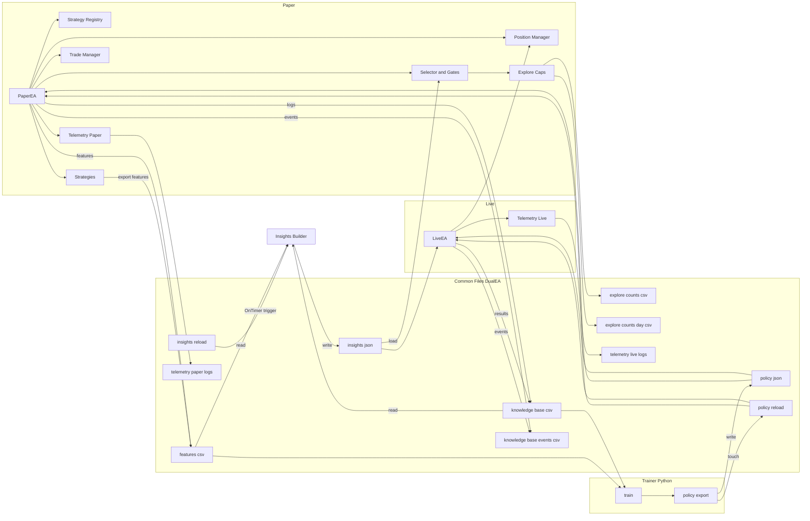

# DualEA (Paper + Live) — Modular Multi‑Strategy EA with Knowledge Base and Roadmap

## Overview
DualEA is a modular Expert Advisor system for MetaTrader 5 designed to:
- Run a Paper EA to test strategies and indicators, logging all activity to a shared Knowledge Base.
- Evolve into a Live EA that reads insights and ML policy from the Knowledge Base to gate and size real trades.
- Support advanced trade management (pending orders, SL/TP, trailing) and per‑strategy modularity.

This repo currently focuses on the Paper EA with a production‑ready architecture for logging and advanced trade management. A multi‑phase roadmap below describes the path to Live EA, ML/LSTM policy learning, and institutional safety.

### Architecture (Mermaid)



## Project Structure
```
MQL5/
├── Experts/
│   └── Advisors/
│       └── DualEA/
│           ├── PaperEA/
│           │   ├── PaperEA.mq5
│           │   └── build_paperea.bat
│           ├── LiveEA/
│           │   ├── LiveEA.mq5
│           │   └── build_liveea.bat
│           ├── Include/
│           │   ├── IStrategy.mqh
│           │   ├── StrategySelector.mqh
│           │   ├── TradeManager.mqh
│           │   ├── PositionManager.mqh
│           │   ├── KnowledgeBase.mqh
│           │   ├── Telemetry.mqh
│           │   ├── InsightsLoader.mqh
│           │   ├── Strategies/
│           │   │   └── ... (8 strategy files)
│           │   └── Indicators/
│           ├── ML/                      # Python trainer + policy export
│           │   ├── train.py
│           │   ├── policy_export.py
│           │   ├── features.py, model.py, dataset.py
│           │   ├── artifacts/
│           │   └── run_train_and_export.bat
│           └── docs/
│               ├── DualEA_Action_Framework.md
│               ├── DualEA_Handbook.md
│               ├── DualEA_Lifecycle_Handbook.md
│               ├── PolicySchema.md
│               ├── PositionManager_Guide.md
│               └── ...
├── Scripts/
│   └── DualEA/
│       ├── InsightsRebuild.mq5
│       ├── PolicyReload.mq5
│       ├── ValidateInsights.mq5
│       └── KBAppendSmoke.mq5
└── Files/ (repo-local; runtime writes go to MT5 Common\Files\DualEA)
```

## Current Capabilities (PaperEA)
- Modular strategies via `IStrategy` base class stored in `CArrayObj`.
- Trade execution via `CTradeManager`:
  - Market and pending orders
  - SL/TP management
  - Trailing stop manager with fixed‑points policy (activation, distance, step)
- Knowledge Base logging via `CKnowledgeBase`:
  - Trade execution events → `knowledge_base_events.csv`
  - Full trade records → `knowledge_base.csv`
  - Both files stored under MT5 Common Files: `Common\Files\DualEA\...`
- Inputs (PaperEA):
  - Position and risk: `LotSize`, `MagicNumber`, `StopLossPips`, `TakeProfitPips`, `MaxOpenPositions` (0=unlimited)
  - Trailing defaults (used if a strategy doesn’t set them): `TrailEnabled`, `TrailType=0(fixed)`, `TrailActivationPoints`, `TrailDistancePoints`, `TrailStepPoints`
  - Mode toggles: `NoConstraintsMode` (bool, default true) — disables all gating and caps for maximum data collection (trading hours, selector gating, insights gating, exploration caps, and open-position limit)
  - Logging: `KBDebugInit` (writes INIT line), `DebugTrailing` (reserved)

### Exploration Mode & Insights Gating
- Purpose: allow limited trades to bootstrap insights for unseen slices (strategy|symbol|timeframe).
- No‑slice‑only bypass: exploration bypass is permitted only when there is truly no existing slice. If a slice exists but fails thresholds, it is blocked (no bypass).
- Caps and persistence:
  - Per‑day cap: `ExploreMaxPerSlicePerDay` (default 2; 0=unlimited)
  - Per‑week cap: `ExploreMaxPerSlice` (default 3; 0=unlimited), week bucket = Monday yyyymmdd
  - Counters persist in Common Files:
    - `DualEA/explore_counts_day.csv` (key,day_yyyymmdd,count)
    - `DualEA/explore_counts.csv` (key,week_monday_yyyymmdd,count)
- Interaction with `NoConstraintsMode`:
  - When enabled, insights gating and exploration caps are bypassed entirely for unrestricted trading.
- Logs (Journal):
  - Allow: `GATE: explore allow <strat> on <symbol>/<tf> ... (day=d/D, week=w/W)`
  - Block (cap): `GATE: blocked ... reason=explore_cap_day|explore_cap_week (day=d/D, week=w/W)`
- Resetting caps: delete the above CSV files from `Common\Files\DualEA` to reset counts.

### Default Policy Fallback & Policy Gating
- Inputs (PaperEA):
  - `UsePolicyGating` (bool)
  - `DefaultPolicyFallback` (bool, default true)
  - `FallbackDemoOnly` (bool, default true)
  - `FallbackWhenNoPolicy` (bool, default true)
- Policy loaded detection:
  - Policy is considered "loaded" when `policy.json` provides one or more slices (i.e., `slices > 0`).
  - `min_confidence` from `policy.json` is used as a gating threshold, not to determine loaded state.
- Fallback paths (neutral, safe for data collection):
  - `fallback_no_policy`: triggers when `UsePolicyGating=true` and no policy is loaded (slices=0) and `FallbackWhenNoPolicy=true`.
    - Allowed by default only on demo accounts (`FallbackDemoOnly=true`).
    - Bypasses insights thresholds and exploration caps.
    - Uses neutral scaling (no SL/TP/trailing multipliers).
    - Log example: `FALLBACK: no policy loaded -> neutral scaling used for <strat> on <symbol>/<tf> demo=<true|false>`.
  - `fallback_policy_miss`: triggers when `UsePolicyGating=true`, policy is loaded but the exact strategy/symbol/timeframe slice is missing.
    - Same allow conditions and behavior as above (demo-only by default, neutral scaling, bypass caps).
    - Log example: `FALLBACK: policy slice missing -> neutral scaling used for <strat> on <symbol>/<tf> demo=<true|false>`.
- Policy scaling application:
  - `ApplyPolicyScaling()` runs only when policy is loaded and an exact/aggregate slice exists (ppol>=0.0).
  - On fallback, scaling is neutral (no adjustments applied).
- Exploration counters:
  - Fallback trades do not consume exploration quotas and do not increment exploration counters.

## Where Files Are Written
We target the MT5 Common Files area so Strategy Tester, Demo/Paper, and Live share the same outputs.
- Typical path: `C:\Users\<you>\AppData\Roaming\MetaQuotes\Terminal\Common\Files\DualEA\`
- Alternative (some installs): `C:\ProgramData\MetaQuotes\Terminal\Common\Files\DualEA\`

Files produced:
- `knowledge_base.csv` (header created at init)
- `knowledge_base_events.csv`
 - `explore_counts.csv` (weekly exploration usage)
 - `explore_counts_day.csv` (daily exploration usage)
 - `insights.json` (aggregated performance by strategy/symbol/timeframe)

## Documentation
- [Phase 3 Plan](docs/Phase3.md)
- [Policy JSON Schema](docs/PolicySchema.md)
- [Knowledge Base CSV Schemas](docs/KB-Schemas.md)
- [Operations Guide](docs/Operations.md)

## Knowledge Base Schemas
- `knowledge_base.csv`
  - Columns: `timestamp,symbol,type,entry_price,stop_loss,take_profit,close_price,profit,strategy_id`
- `knowledge_base_events.csv`
  - Columns: `timestamp,strategy,retcode,deal,order`

## How To Build
- Use the provided batch script:
  - Open a terminal in `MQL5/Experts/DualEA/`
  - Run: `compile.bat`
- Or compile `PaperEA.mq5` from MetaEditor.

## How To Run (Strategy Tester)
1. Open Strategy Tester and select `PaperEA`.
2. On the Inputs tab, click Reset to load the latest defaults.
3. Adjust `LotSize`, `SL/TP`, and trailing inputs as needed.
4. Run a backtest; outputs will be in `Common\Files\DualEA\` and visible in the Journal.

## Trainer Workflow (Windows)
 - Requirements: Python 3, internet access (for pip + Yahoo enrichment).
 - Steps:
   1) Open a terminal in `MQL5/Experts/DualEA/ML/`.
   2) Run: `run_train_and_export.bat`
 - What it does:
   - Creates `.venv/`, installs `ML/requirements.txt`.
   - Runs `train.py` to produce `ML/artifacts/tf_model.keras`, `scaler.pkl`, `features.json`.
   - Runs `policy_export.py --min_conf 0.45` to write `Common\Files\DualEA\policy.json` with per-slice `p_win` and scaling fields: `sl_scale`, `tp_scale`, `trail_atr_mult`.
   - Touches `Common\Files\DualEA\policy.reload`.
- EA behavior:
  - `PaperEA` calls `CheckPolicyReload()` in both `OnTimer()` and `OnTick()`; when `policy.reload` exists, it reloads `policy.json` and logs `Policy gating: min_conf=..., slices=N`.
  - On trade execution, if policy is loaded, the EA applies per-slice scaling before sending the order.

### Rebuilding Insights (without rerunning trades)
- Use the provided script to recompute `insights.json` from the current `features.csv`:
  1) In MT5 Navigator → Scripts → run `InsightsRebuild`.
  2) Check `Common\Files\DualEA\insights.json` and Journal for status.

## Troubleshooting
- “No CSVs in MQL5/Files”: Expected. Tester and Live now write to `Common\Files\DualEA` using `FILE_COMMON`.
- “Error 5004 opening file”: First‑run read attempts can fail if the file doesn’t exist; the constructor now creates the file and header without logging an error.
 - “Inputs not showing in Tester”: Click Inputs → Reset; MT5 caches previous inputs.

---

## PaperEA

- Purpose: primary data-collection EA for backtests and demo/paper runs. Logs features, events, and trades to the shared Knowledge Base for ML and insights.
- Execution model:
  - OnInit/OnTick drive the scan→gate→execute path; logs to KB on every decision and execution.
  - Policy reload via `DualEA/policy.reload` checked in `CheckPolicyReload()`; telemetry flush after scans.
  - Timer-based scanning per Phase 6 design may be enabled as parity with LiveEA (see Phase 6) where implemented.
- Gating and exploration caps:
  - `NoConstraintsMode` (default true) can bypass all gates/caps for unrestricted exploration (for ML bootstrapping).
  - Exploration caps persist in Common Files: `DualEA/explore_counts_day.csv`, `DualEA/explore_counts.csv`.
  - No‑slice‑only bypass: exploration only bypasses when a slice truly doesn’t exist; existing under‑threshold slices remain gated.
  - Reset by deleting the above CSVs in `Common\Files\DualEA`.
- Policy integration and fallback:
  - Inputs: `UsePolicyGating`, `DefaultPolicyFallback`, `FallbackWhenNoPolicy`, `FallbackDemoOnly`.
  - When policy is loaded and slice exists, `ApplyPolicyScaling()` adjusts SL/TP/trailing.
  - On fallback (no policy or slice missing), trades use neutral scaling, do not consume exploration quotas, and bypass caps (demo‑only by default).
- Persistence paths (MT5 Common Files):
  - `knowledge_base.csv`, `knowledge_base_events.csv`, `features.csv`, `insights.json`, exploration CSVs under `Common\Files\DualEA`.
- CI hooks (insights freshness + coverage):
  - Use `kb_check.bat` to rebuild and validate `insights.json` headlessly; fails on stale/empty slices and on missing required coverage.
  - Example:
    ```powershell
    kb_check.bat --build-insights --attempt-run-script --run-validate --fail-on-stale --fail-on-empty-slices --require-symbols=USDCNH --require-timeframes=60 --require-strategies=BollAverages,DonchianATRBreakout,RSI2BBReversion --fail-on-missing-required --show-report
## Roadmap (Phased)
This roadmap aligns with the implementation plan.

 For detailed Phase 3 guidance (docs, hygiene, scoring, roadmap), see:
 - `docs/Phase3.md`

### Action Framework — 3 Phases × 3 Cycles (Merged)
 - Source: `docs/DualEA_Action_Framework.md` (full details and templates)
 
 - Phase 1 — Codebase & Requirements Deep Dive
   - Cycle 1: Structural Audit (jailbreak permitted)
     - Inventory gating paths (strategy → policy → insights → execution)
     - Trace file I/O and timers: `CheckPolicyReload()`, `CheckInsightsReload()`, staleness checks
     - Identify insertion points: circuit breakers, session/news filters, PositionManager, correlation, vol sizing, regime
     - Deliverables: audit map + risk log
   - Cycle 2: Requirements Mapping
     - Spec one‑pagers per feature with inputs, data flow, telemetry, failure/rollback
   - Cycle 3: Risk & Gaps Closure
     - Threat model: file races, stale artifacts, partial reloads; decide LiveEA fail‑safe defaults
     - Deliverables: mitigations + rollback levers; updated lifecycle gates
 
 - Phase 2 — Design, Build, Validate
   - Cycle 1: Task Decomposition
     - Backlog with effort/risk/owner/sequence for FR‑01..FR‑10
   - Cycle 2: Code + Peer Review
     - Definition of Ready: inputs defined, telemetry standardized, rollback behavior set
     - Guidelines: feature flags (`Use*`), shared includes under `Include/`
   - Cycle 3: QA + Fuzzing
     - Unit‑like stubs, deterministic sims, log assertions; fuzz missing files/reload storms/high‑tick
 
 - Phase 3 — Polish, Lockdown, Final Scoring
   - Cycle 1: Docs & architecture alignment (README + lifecycle + operator runbooks)
   - Cycle 2: Code hygiene & consistency (inputs/enums/log tags; dead‑code purge)
   - Cycle 3: Final scoring (correctness/safety/observability/perf) + next roadmap
 
 #### Action Backlog (Pre‑Implementation Specs)
 - FR‑01 Circuit Breakers — Inputs: `UseCircuitBreakers`, `DailyLossLimit`, `DailyDrawdownLimit`, `CooldownMinutes`; block entries, allow exits; telemetry `cb:*`; DoD: day rollover sims
 - FR‑02 Session/Window Filter — Inputs: `UseSessionFilter`, `SessionTZ`, `SessionWindows`; pre‑gate block; DoD: DST/tz edges
 - FR‑03 News Filter — Inputs: `UseNewsFilter`, `ImpactLevelMin`, `PreLockoutMin`, `PostLockoutMin`; offline‑safe fallback; DoD: replay test
 - FR‑04 Position Manager (v1) — Inputs: `UsePositionManager`, `ExitProfile`, `ClusterMinPts`, `PerSymbolMax`; centralized exits/scaling hooks; DoD: backtest diffs
 - FR‑05 Correlation Exposure Caps — Inputs: `UseCorrelationCaps`, `CorrLookbackDays`, `MaxGroupExposure`; cap grouped exposure; DoD: deterministic calc
 - FR‑06 Volatility Position Sizing — Inputs: `UseVolSizing`, `ATRPeriod`, `RiskPerTrade`; ATR‑adaptive lots; DoD: regime consistency, caps respected
 - FR‑07 Regime Detector Stub — Inputs: `UseRegime`, `RegimeMethod`; tag regime; optional gating modifier; DoD: stable tags
 - FR‑08 Promotion Gate & Evaluator — Inputs: min trades/hit‑rate/expectancy/DD/Sharpe; artifact: `Scripts/DualEA/AssessPromotion.mq5`; DoD: reproducible
 - FR‑09 Telemetry Standardization & Ops Views — Event schema/fields/severity; rotate/size bounds; optional ops notebooks
 - FR‑10 Performance — Event batching, log throttling, timer cadence review; DoD: CPU/mem profile under stress
 
 #### Control Gates (Before Coding)
 - Gate A: Specs complete (inputs, flow, telemetry, rollback) for FR‑01..FR‑10
 - Gate B: Test plans defined; simulators/log assertions ready
 - Gate C: Security + fail‑safe review; LiveEA defaults conservative
 
 #### Ownership & Sequencing (Draft)
 - Wave 1 (risk first): FR‑01, FR‑02, FR‑08
 - Wave 2 (exposure/positioning): FR‑04, FR‑05, FR‑06
 - Wave 3 (context/perf): FR‑03, FR‑07, FR‑09, FR‑10
 - Note: Features default‑off in LiveEA until validated in PaperEA
 
  ### Status Dashboard
  - Completed:
    - Phase 1: Data & Insights Foundation (insights builder, headless rebuild, validator, CI flags, Common Files outputs)
  - Phase 2a: PaperEA Execution & Telemetry (baseline complete; timer-scan parity tracked under Phase 6)
  - Phase 3 (core): LiveEA core loop with policy gating/fallbacks and scaling
    - `LiveEA/LiveEA.mq5`: policy hot‑reload (tick+timer), `ApplyPolicyScaling()` incl. `trail_scale` and `trail_atr_mult`, fallback gating (`fallback_no_policy`, `fallback_policy_miss`, demo‑only by default), heartbeat with fallback flags
- In Progress:
  - Phase 3: LiveEA hardening (risk gates, stricter caps, optional shadow‑mode, per‑minute de‑dup)
  - Phase 6: Low‑Latency Minutely Scanner & ML‑Enriched Orchestration
  - Phase 6: Low‑Latency Minutely Scanner & Orchestration (central `ScanStrategies`, minute de‑dup, parity with OnTick)
  - Phase 2a → P1C1 (ACTIVE): Structural Audit for PaperEA (gating/caps persistence, telemetry, KB writes, insights staleness, CI validators)
  - Phase 4/7/8: Risk/Telemetry/Adversarial hardening — partial primitives present
- Not Implemented:
  - Phase 2: ML/LSTM Pipeline (trainer + policy export)
  - Phase 5, 9, 10, 11

### Phase 1: Data & Insights Foundation
- Extend KB: record per‑trade features (indicator values, ATR, spread, session, regime, signal strength) and labels (R multiple, MFE/MAE, duration).
- Add `InsightsBuilder` to compute win‑rate, average R, PF, “top signals”, write `insights.json` to `Common\Files\DualEA`.
- Export `features.csv` for ML training.

- Suggestions:
  - Auto‑build `insights.json` at startup if missing/stale (compare mtime vs `features.csv`/`knowledge_base.csv`) via `CInsightsBuilder.Build()` in `OnInit()`.
  - Add `Scripts/ValidateInsights.mq5` to CI: assert schema, required slices, and non‑empty metrics.
  - Ensure `FolderCreate("DualEA", FILE_COMMON)` before all writers; handle first‑run creation gracefully.
  - Use robust readers (`FILE_TXT|FILE_ANSI`), skip malformed rows; log and continue.
  - Version `insights.json` schema and add compatibility checks in `Include/StrategySelector.mqh`.

### Phase 2: ML/LSTM Pipeline
- Build Python trainer (PyTorch/TensorFlow) that reads `features.csv`, trains an LSTM/GRU to predict Prob(win) or Expected R.
- Export `policy.json` with per‑symbol/timeframe thresholds, strategy weights, and SL/TP/trailing scaling.
- PaperEA: load `policy.json` on a timer; gate trades by min‑confidence and adapt order parameters.

Note (sequencing): after completing Phase 3 — Cycle 3 of the red‑team execution plan, we will start Phase 2 — Cycle 1 (structural audit) here.

- Suggestions:
  - Use walk‑forward splits; track ROC‑AUC, Brier, Expected‑R; calibrate probabilities and thresholds per slice.
  - Export `policy.json` with provenance (model hash, train window, metrics); sign/hash for integrity.
  - Run A/B policies and shadow evaluation in PaperEA before promotion to LiveEA.
  - Log SHAP/feature importance to monitor drift and potential leakage.

### Phase 2a: PaperEA Execution & Telemetry
- Implement and refine `PaperEA` as the primary data‑collection execution engine before LiveEA.
- Key deliverables:
  - Modular strategies via `IStrategy` with `ExportFeatures()`; telemetry and features logged to the Knowledge Base.
  - Exploration caps and gating, `NoConstraintsMode` for unrestricted exploration, policy hot‑reload and safe fallbacks.
  - Persistence to MT5 Common Files; insights rebuild/validation CI hooks via `Scripts/InsightsRebuild.mq5`, `Scripts/ValidateInsights.mq5`, and `kb_check.bat`.
 - Status:
  - Baseline complete (see top‑level “PaperEA” section above).
  - Timer‑based scanning parity with LiveEA is tracked under Phase 6.

 #### Red‑Team Execution Plan (3×3) — Phase 2a
 - Phase 1: Codebase & Requirements Deep Dive
   - Cycle 1 (ACTIVE): Structural Audit for PaperEA (gating/caps, telemetry and features logging, KB persistence to Common Files, insights builder/staleness, CI validators: `Scripts/ValidateInsights.mq5`, `Scripts/InsightsRebuild.mq5`, `kb_check.bat`, `scripts/RunInsightsValidation.ps1`, `ScheduleInsightsValidation.ps1`)
   - Cycle 2: Requirements Mapping → trace inputs/outputs, CSV schemas, file paths, logs, rebuild/validate flows to code locations
   - Cycle 3: Risk & Gaps Closure → harden fallbacks, file I/O sharing, staleness triggers, and timer parity
 - Phase 2: Design, Build, Validate
   - Cycle 1: Task decomposition and acceptance criteria for PaperEA improvements
   - Cycle 2: Implement fixes; peer review; adversarial edge‑case tests
   - Cycle 3: QA + fuzzing; enforce CI gates (fail‑on‑stale, fail‑on‑empty‑slices, required coverage)
 - Phase 3: Polish, Lockdown, Final Scoring
   - Cycle 1: Docs & architecture alignment (PaperEA section + ops)
   - Cycle 2: Code hygiene & consistency
   - Cycle 3: Final scoring + roadmap

 ### Phase 3: LiveEA & Feedback Loop
- Implement `LiveEA.mq5` with the same strategies but stricter gating (policy + risk limits).
- LiveEA logs to the same KB; trainer merges Paper+Live data.
- Feedback loop: Paper adapts based on Live outcomes via retrained policy.
- Status:
  - Implemented (in `Experts/Advisors/DualEA/LiveEA/LiveEA.mq5`):
    - Policy load and hot‑reload on tick+timer; `g_policy_loaded` set by slice presence
    - Gating with safe fallbacks (`DefaultPolicyFallback`, `FallbackWhenNoPolicy`, `FallbackDemoOnly`); neutral scaling on fallback
    - `ApplyPolicyScaling()` including trailing scaling via `trail_scale` (fixed) and `trail_atr_mult` (ATR)
    - Heartbeat GATE summary includes fallback flags for observability
  - Remaining:
    - Shadow‑mode and tighter gates vs PaperEA (min_conf, spread/news/session caps)
    - Risk/circuit‑breaker enforcement inputs and guards
    - One‑execution‑per‑slice‑per‑minute de‑dup; deterministic tie‑breakers
    - Full timer‑scan parity (see Phase 6)
- Suggestions:
  - Enable LiveEA shadow‑mode: log all candidate decisions; execute only top ML‑ranked passing min_conf and risk budget.
  - Tighten gates vs PaperEA: stricter min_conf, spread/news/session caps, lower exploration caps.
  - Policy hot‑reload with guardrails; rollback to last‑known‑good on parse/plausibility failure.
  - Deterministic tie‑breakers across strategies; enforce one execution per slice per minute.

#### Red‑Team Execution Plan (3×3) — Current focus
- Phase 1: Codebase & Requirements Deep Dive
  - Cycle 1 (ACTIVE): Structural Audit for LiveEA (gating, timer scanning, selector, insights staleness, telemetry)
  - Cycle 2: Requirements Mapping to concrete code paths and artifacts; close gaps
  - Cycle 3: Risk & Gaps Closure; redesign fragile modules as needed
- Phase 2: Design, Build, Validate
  - Cycle 1: Task decomposition for LiveEA hardening; define acceptance criteria
  - Cycle 2: Implement fixes; peer review and adversarial edge‑case tests
  - Cycle 3: QA + fuzzing of IO/races; enforce CI gates
- Phase 3: Polish, Lockdown, Final Scoring
  - Cycle 1: Docs & architecture alignment (README + docs/Phase3.md)
  - Cycle 2: Code hygiene & consistency; refactors; dead‑code purge
  - Cycle 3: Final scoring + roadmap

Next: Upon completing Phase 3 — Cycle 3 above, begin Phase 2 — Cycle 1 (ML/LSTM Pipeline) as the next 3×3 plan.

### Phase 4: Risk & Safety Systems
- Circuit breaker: `MaxDailyLossPct`, `MaxDrawdownPct`, `MinMarginLevel`, `MaxOpenPositions`, `ConsecutiveLossLimit`.
- Optional VaR: estimate risk from recent PnL distribution; block trading if risk exceeds limits.
- Audit logging and hard enforcement in OnTick before execution.

- Suggestions:
  - Add news blackout windows; dynamic spread/ATR caps per symbol/timeframe; configurable.
  - Slippage guard and liquidity failure handling; cool‑down after repeated execution failures.
  - Persist daily and consecutive loss counters in `FILE_COMMON` for robustness across restarts.
  - Optional VaR budget gating; circuit‑breaker resume schedule and manual override.

### Phase 5: Dynamic Strategy/Indicator Selection
- Discover strategies/indicators dynamically, score by stability, PF, correlation, and regime fitness.
- Policy selects and weights a subset per symbol/timeframe.

- Suggestions:
  - Maintain a strategy registry per symbol/timeframe with IDs and dependencies; prune highly correlated pairs.
  - Add multi‑timeframe confirmations; define parameter stability ranges and bounds.
  - Periodically re‑score strategies and disable underperformers; export strategy state to features.

### Phase 6: Low‑Latency Minutely Scanner & ML‑Enriched Orchestration
- Status: Partial — OnTimer heartbeat/reload present; centralized `ScanStrategies` with minute de‑dup not yet implemented.
- Guarantee both EAs "look" for trades at least every minute, independent of tick arrival.
  - Add inputs: `TimerScanEnabled` (bool, default `true`), `TimerScanSeconds` (int, default `60`).
  - `OnInit()`: configure `EventSetTimer(TimerScanSeconds)` when `TimerScanEnabled`.
  - `OnTimer()`: run a `ScanStrategies()` routine that performs the same Refresh → CheckSignal → gating (selector + insights + policy + caps) path as `OnTick()`.
  - Deduplicate within a minute per `symbol|timeframe|strategy` using a rolling `LastScanMinute` map to avoid duplicate triggers if ticks also arrive.
  - Preserve existing behavior: always `CheckPolicyReload()` and `Telemetry.Flush()` on timer.
- Performance & reliability hardening
  - Pre‑create and reuse indicator handles for all registered strategies/timeframes to avoid reallocation overhead per scan.
  - Cache policy and insights in memory; throttle file I/O to timer ticks; batch telemetry writes.
  - Optional: `EventSetMillisecondTimer(250–1000ms)` for ultra‑low‑latency scanning in LiveEA; gate by CPU budget.
- LiveEA enrichment path
  - Consume trained ML outputs for per‑slice `min_conf`, expected‑R, and dynamic sizing; apply via `ApplyPolicyScaling()`.
  - Maintain exploration caps and detailed `LogGating`/`LogGatingShadow` for full auditability.
- Test & validation plan
  - Backtests: walk‑forward with OOS across 3–5y per symbol/TF, including realistic spread/slippage/commission; parameter stability and FDR controls.
  - Forward tests: parallel demo/real, M1 granularity logs, latency SLO (<250ms scan→gate→exec where broker allows), missed‑opportunity audits.
  - Monitoring: 60s heartbeat, exploration cap summaries, and per‑slice gating counters.

 - Suggestions:
   - Guard `OnTimer()` with a re‑entrancy flag to prevent overlapping scans; prefer non‑blocking work.
   - Expose `TimerScanSeconds` overrides (e.g., 30s) and optional `EventSetMillisecondTimer` for LiveEA with CPU budget guard.
   - Record scan→gate latency metrics; emit to telemetry for SLO tracking.
   - Pre‑warm indicator handles in `OnInit()`; refresh/rebuild on symbol/period change; cache policy/insights in memory.
   - Centralize gating in a reusable `EvaluateAndMaybeExecute()` path used by both `OnTick()` and timer scans.

### Phase 7: Monitoring & Telemetry
- Emit telemetry CSV/JSON (tick latency, SL moves, trades/sec, error rates).
- Optional lightweight dashboard (HTML/JS) or notebook to visualize metrics.

- Suggestions:
  - Define SLOs: scan→gate latency, missed‑opportunity rate, per‑reason gating counts.
  - Alerts for policy/insights read failures and staleness; log rotation and retention policy.
  - Optional dashboard/notebook; per‑slice counters and trend lines for drift/anomaly detection.

### Phase 8: Adversarial/Jailbreak Hardening
- Fuzz file I/O (empty/corrupt/locked `policy.json`/`insights.json`/CSV) and assert safe fallbacks, halts, or rollbacks.
- Timing/race tests: low-tick periods, bar-boundary races, clock skew; verify de-dup and single-exec semantics.
- Resource pressure: very large CSVs, slow disk; ensure `OnTick()` remains non-blocking, heavy I/O on timer.
- Produce Q&A logs, expert rebuttals, and jailbreak traces mapped to files/modules per @/greep.

 - Suggestions:
   - Add `SafeMode` input to force conservative gating on anomalies; persist last‑known‑good `policy.json`/`insights.json` caches.
   - Create a fuzz harness (script/test) that mutates JSON/CSV and asserts expected EA behavior and logs.
   - Store jailbreak trace logs in `Common\Files\DualEA\jailbreak\` with timestamps and module references.
   - Automate adversarial tests in CI; fail the pipeline on missing fallbacks or unsafe behavior.

### Phase 9: MLOps & Continuous Training
- Data/versioning (DVC/Git LFS), model registry, and feature/label drift detection with alerts.
- Scheduled retraining and policy export with provenance (model hash, data window, metrics).
- Canary deployment of `policy.json` and automatic rollback on degradation or plausibility failures.

 - Suggestions:
   - Define acceptance criteria (min ROC‑AUC/Brier, uplift vs baseline) before policy promotion to LiveEA.
   - Build reproducible training pipelines (seeded, environment‑pinned) and artifact signing.
   - Add drift detectors on features/labels; trigger retrain or quarantine when thresholds are exceeded.
   - Maintain a data catalog of `features.csv` schema versions and TTL/retention policies.

### Phase 10: Multi‑Symbol/TF Orchestration (Optional)
- Option A: one EA per symbol/TF (simple, robust). Option B: single orchestrator scanning a configured portfolio.
- Central registry of symbols/TFs; per-slice de‑dup and CPU budget/load shedding to maintain latency SLOs.
- Consistent telemetry across all slices; portfolio‑level risk budget enforcement.

 - Suggestions:
   - For orchestrator mode: implement per‑slice schedule, backpressure, and fairness to avoid starving symbols.
   - Throttle scanning and degrade gracefully under CPU load; prioritize LiveEA executions.
   - Guard broker API calls; exponential backoff on transient errors; per‑symbol error budgets.
   - Keep robust chart‑per‑slice mode as default until orchestrator proves reliability.

### Phase 11: Performance & Resilience
- Avoid heavy file I/O in `OnTick()`; defer to timer/batched writes; use `FILE_SHARE_*` and rotate logs.
- Pre‑allocate buffers, reuse indicator handles; cap log verbosity on hot paths.
- Watchdog for timer and safe‑mode fallbacks on parse errors (use last‑known‑good caches).

 - Suggestions:
   - Implement log rotation (daily/size‑based) and retention; compress archives.
   - Add a timer watchdog that re‑initializes the timer if missed deadlines are detected.
   - Use re‑entrancy guards around critical sections (order placement, persistence writes).
   - Ensure `OnDeinit()` flushes telemetry and persists counters atomically.

---

## Next Milestones
  - Add features.csv export and insights.json aggregation.
  - Provide Python ML trainer and batch launcher (writes policy.json).
  - Add `policy.json` loader in PaperEA and gating/scaling application.
  - Skeleton `LiveEA.mq5` with circuit breaker checks.

## License
Copyright 2025, Windsurf Engineering.

If you truly need low-latency sync later, consider:
- Named pipes or local TCP with a lightweight Python service
- A minimal REST loopback server

Note: These add failure modes and deployment friction; file-based I/O is simpler and reliable for MT5. Prefer file-based until a concrete latency SLO requires otherwise.

## Appendix A: Red‑Team Artifacts (Q&A, Rebuttals, Jailbreak Traces)

To operationalize the 3×3 red‑team process, store artifacts in MT5 Common Files for both Tester and Live to access.

- Base path: `Common\\Files\\DualEA\\jailbreak\\`
- Run layout:
  - `jailbreak\\runs\\YYYYMMDD_HHMMSS/`
    - `qna.md` — Q&A log for the session
    - `rebuttals.jsonl` — Expert rebuttals (JSONL)
    - `traces.jsonl` — Jailbreak traces (JSONL)
    - `summary.md` — Short session summary with outcomes and follow‑ups
  - `jailbreak\\latest/` — optional symlink/copy of most recent run for dashboards

### A.1 Q&A Log (Markdown)

Minimal, structured template capturing prompts, answers, and references to code.

```markdown
# Red‑Team Q&A — <YYYY‑MM‑DD HH:MM:SS>

## Q1: <question>
- Context: <module(s) e.g., `Experts/Advisors/DualEA/PaperEA/PaperEA.mq5`>
- Hypothesis: <expected behavior>
- Answer: <observed behavior/decision>
- Evidence: <file refs, line ranges, logs>
- Outcome: pass | fail | needs‑followup

## Q2: ...
```

### A.2 Expert Rebuttals (JSONL)

One JSON per line with explicit links to files/modules and decisions.

```json
{"id":"rb_0001","claim":"Exploration bypass triggers with existing slice","rebuttal":"Bypass is no‑slice‑only; existing under‑threshold slices are gated","evidence_files":["Experts/Advisors/DualEA/PaperEA/PaperEA.mq5"],"decision_paths":["Gate->Insights->ExploreCaps"],"status":"resolved","timestamp":"2025-08-17T00:00:00Z"}
```

Fields:
- `id`: stable id
- `claim`: red‑team claim
- `rebuttal`: concise counterargument
- `evidence_files`: array of repository paths
- `decision_paths`: e.g., `Scan->Selector->Gate->Execute`
- `status`: open | resolved | needs‑work
- `timestamp`: ISO8601

### A.3 Jailbreak Traces (JSONL)

Record adversarial tests, input mutations, expected vs observed behavior, and severity.

```json
{"ts":"2025-08-17T00:00:00Z","module":"PolicyLoader","file":"Experts/Advisors/DualEA/Include/StrategySelector.mqh","symbol":"EURUSD","timeframe":60,"case":"corrupt_policy_json","mutation":"truncated file","expected":"fallback to last‑known‑good policy with log and no crash","observed":"fallback engaged; neutral scaling applied","outcome":"safe","severity":"low","artifacts":["Common/Files/DualEA/policy.json","Common/Files/DualEA/policy.backup.json"],"notes":"Validated timer reload path and guardrails"}
```

Fields:
- `ts`: timestamp
- `module`, `file`: component and path under repo
- `symbol`, `timeframe`: slice context when applicable
- `case`, `mutation`: short names for cataloging
- `expected`, `observed`: behaviors
- `outcome`: safe | unsafe | inconclusive
- `severity`: low | medium | high
- `artifacts`: related files (Common Files paths allowed)
- `notes`: free‑form

### A.4 Traceability Rules

- Always reference concrete files/paths (e.g., `Experts/Advisors/DualEA/LiveEA/LiveEA.mq5`).
- Map each finding to a decision path: `OnTick()->ScanStrategies()->Gating()->TradeManager.Execute()`.
- Prefer JSONL for machine‑readable aggregation; keep Markdown summaries for humans.
- Attach log snippets (Journal) and KB rows when relevant.

### A.5 CI Hooks

- Copy the latest run into `jailbreak\\latest/` after each session.
- Optional validator can assert that for each `case` seen in traces there is at least one `outcome=safe` or an open issue.
- Include red‑team artifacts in reports alongside insights validation.

### A.6 Operational Notes

- PaperEA and LiveEA do not read from `jailbreak/`; it is a write‑only audit area.
- Keep PII/broker identifiers out of logs; sanitize before sharing.
- Large artifacts (CSV/JSON) should be rotated/compressed if size grows beyond operational limits.
