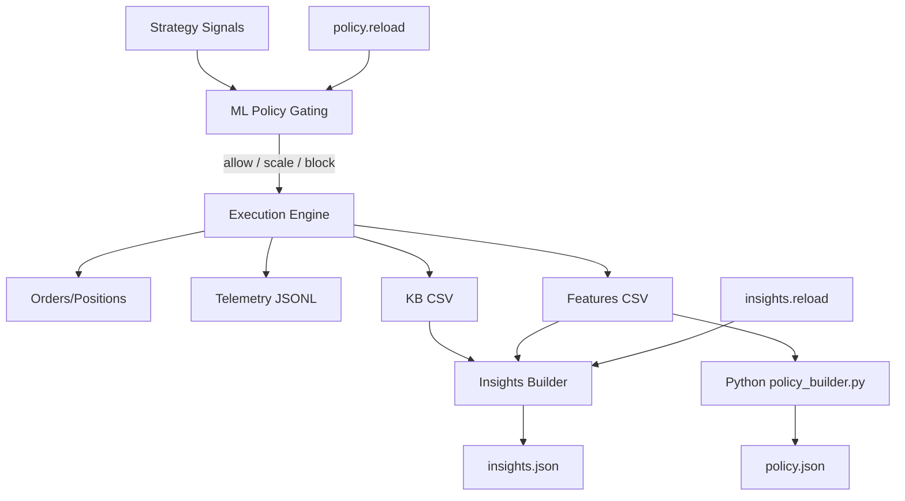

# DualEA Handbook

A concise, single-source guide for operating, extending, and validating DualEA (PaperEA + LiveEA) with ML policy gating and insights.

## 1) Overview
DualEA comprises two EAs that share the same pipeline and Common Files:
- PaperEA (`../PaperEA/PaperEA_v2.mq5`) — safe simulation/parity validation
- LiveEA (`../LiveEA/LiveEA.mq5`) — live execution with additional guards

Both consume:
- ML Policy (`Common\\Files\\DualEA\\policy.json`) for gating and scaling
- Insights (`Common\\Files\\DualEA\\insights.json`) for heuristics/exploration
- Datasets (`Common\\Files\\DualEA\\features.csv`, `knowledge_base.csv`)
- Telemetry (`Common\\Files\\DualEA\\telemetry/*.jsonl`)

## 2) Architecture

## 3) Files and Paths (Common Files)
- `DualEA/policy.json` — min_confidence + slice entries (strategy, symbol, timeframe, p_win, optional sl/tp/trail scales)
- `DualEA/insights.json` — compact model of recent performance slices
- `DualEA/features.csv` — indicator/market features
- `DualEA/knowledge_base.csv` — trade/events log
- `DualEA/telemetry/*.jsonl` — EA lifecycle + gating/exec events
- `DualEA/policy.reload`, `DualEA/insights.reload` — on-demand control flags

## 4) Key Inputs (PaperEA/LiveEA)
- `UsePolicyGating` — turn gating/scaling logic on
- `DefaultPolicyFallback` — neutral allow on slice miss
- `FallbackDemoOnly` — restrict fallback to demo (PaperEA)
- `FallbackWhenNoPolicy` — allow when policy.json missing
- `InsightsAutoBuild` — periodic rebuild when stale
- `InsightsCheckOnTimer` + `InsightsStaleHours` — staleness window

## 5) Timer Wiring and Signals
Both EAs call on timer:
- `CheckPolicyReload()` — watches `DualEA/policy.reload`; calls `Policy_Load()`
- `CheckInsightsReload()` — watches `DualEA/insights.reload`; calls `Insights_RebuildAndReload("reload")`
- Staleness path: `Insights_IsStale()` → `Insights_RebuildAndReload("timer")`

## 6) ML Pipeline
- Export features/trades from EAs (auto during operation)
- Train policy via Python: `../ML/policy_builder.py`
  - Reads `features.csv` + `knowledge_base.csv`
  - Writes `policy.json` slices and `min_confidence`
- Hot reload with `policy.reload`

See: `../ML/README.md`.

## 7) Operations Runbook
- __Reload policy__: create empty `Common\\Files\\DualEA\\policy.reload`
- __Rebuild insights__: create empty `Common\\Files\\DualEA\\insights.reload`
- __Validate insights__: run `Scripts/DualEA/ValidateInsights.mq5` (writes `insights_validation.txt`)
- __Export history (optional)__: `Scripts/DualEA/ExportHistory.mq5`
- __Telemetry__: inspect `Common\\Files\\DualEA\\telemetry/*.jsonl`

See: `./Operations.md`.

## 8) Quick Starts
- __PaperEA__
  1) Attach `PaperEA` to chart; allow file ops
  2) Ensure `policy.json` exists (or rely on fallbacks)
  3) Monitor telemetry and Experts tab
  4) Use reload flags for iterative dev
  
  See: `./PaperEA_README.md` and `./PaperEA_IMPLEMENTATION_PLAN.md`.

- __LiveEA__
  1) Compile and attach with safety guards enabled
  2) Confirm `policy.json` and staleness checks
  3) Observe gating/scaling and order flow
  
  See: `./LiveEA_README.md` and `./LiveEA_IMPLEMENTATION_PLAN.md`.

## 9) Backtesting and Parity
- Keep PaperEA and LiveEA timer/reload logic in sync
- Compare ML ON vs OFF using `../PaperEA/PaperEA_backtest.ini` patterns
- Audit telemetry deltas and policy slice hit rates

## 10) Position Manager (Planned)
- Module: `../Include/PositionManager.mqh`
- Integrate behind `UsePositionManager` input (scaling, exits, correlation, brackets)

## 11) Troubleshooting
- __No policy effect__: Check `policy.json` schema, `UsePolicyGating`, and min_confidence
- __Fallback triggered often__: Missing slices — verify strategy/symbol/timeframe keys
- __Insights stale__: Run `ValidateInsights.mq5`; trigger `insights.reload`
- __No files written__: Confirm MT5 file ops allowed and Common Files path
- __Performance__: Reduce log level, confirm telemetry buffer sizes

## 12) Reference Map
- Code:
  - `../PaperEA/PaperEA_v2.mq5`
  - `../LiveEA/LiveEA.mq5`
  - `../Include/` (Insights Builder, Telemetry, KB)
- Docs:
  - `./CORE_IMPLEMENTATION_PLAN.md`
  - `./PaperEA_README.md`
  - `./LiveEA_README.md`
  - `./PaperEA_IMPLEMENTATION_PLAN.md`
  - `./LiveEA_IMPLEMENTATION_PLAN.md`
  - `./Operations.md`
- ML:
  - `../ML/README.md`
  - `../ML/policy_builder.py`
