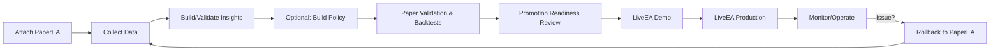

# DualEA Lifecycle Handbook — From PaperEA to LiveEA

A practical, end-to-end runbook for bringing up DualEA on PaperEA, validating, promoting, operating LiveEA, and rolling back safely.

## 0) Prerequisites
- MT5 installed; file operations enabled for EAs
- Access to MT5 Common Files folder
  - Typical: `C:\Users\<you>\AppData\Roaming\MetaQuotes\Terminal\Common\Files\DualEA\`
  - Alternate: `C:\ProgramData\MetaQuotes\Terminal\Common\Files\DualEA\`
- DualEA source tree present (this repo)

## 1) PaperEA Bring-up
- Attach `../PaperEA/PaperEA.mq5` to a demo chart.
- Configure inputs (suggested initial values):
  - `NoConstraintsMode = true` (max data collection)
  - `UsePolicyGating = false` (start baseline without ML)
  - `ExploreMaxPerSlice = 0`, `ExploreMaxPerSlicePerDay = 0` (unlimited while learning)
  - `MaxOpenPositions = 0` (no cap in pure data mode)
  - `InsightsAutoBuild = true`, `InsightsCheckOnTimer = true`, `InsightsStaleHours` as desired (e.g., 24)
- Verify file outputs appear under Common Files:
  - `DualEA\features.csv`, `DualEA\knowledge_base.csv`, `DualEA\knowledge_base_events.csv`
  - `DualEA\telemetry\*.jsonl`

## 2) Insights Lifecycle in PaperEA
- Auto-build: PaperEA will run staleness checks and rebuild if `InsightsAutoBuild=true`.
- Manual rebuild anytime:
  - Create `DualEA\insights.reload` (empty file) OR run `Scripts/DualEA/InsightsRebuild.mq5`.
- Validate insights:
  - See `./Operations.md` for validation steps and artifacts (e.g., `insights_validation.txt`).
- Ensure selector gating is reasonable; with `NoConstraintsMode=true`, selector gating is bypassed for data collection.

## 3) Paper Validation & Backtests
- Baseline without policy gating:
  - Keep `UsePolicyGating=false` initially. Accumulate several days of data.
  - Review Experts tab and `telemetry/*.jsonl` for healthy signal flow.
- Optional ML A/B (PaperEA):
  - Turn `UsePolicyGating=true` after you have `policy.json` (see section 4).
  - Compare ON vs OFF backtests and forward-paper runs.
- Acceptance gates to move forward (suggested):
  - Min episode count per key strategy/symbol/timeframe slice
  - Insights coverage > X% of active slices
  - No critical errors in telemetry; stable explore counters where applicable

## 4) Policy (Optional) — When You Are Ready
- Build policy externally or via provided scaffolding:
  - See `../ML/README.md` and `../ML/policy_builder.py` (reads `features.csv` + `knowledge_base.csv`, writes `policy.json`).
- Drop policy into Common Files: `DualEA\policy.json`.
- Reload in EA:
  - Create `DualEA\policy.reload` (empty file) or wait for next timer check.
- Configure gating knobs in PaperEA:
  - `UsePolicyGating = true`
  - `DefaultPolicyFallback`, `FallbackDemoOnly`, `FallbackWhenNoPolicy` as desired

## 5) Promotion Readiness Review
- Turn off unconstrained mode:
  - `NoConstraintsMode = false`
  - Set realistic `ExploreMaxPerSlice`/`PerDay` caps (e.g., 2/day, 3/week) if using exploration.
- Confirm operational checks:
  - `insights.json` recent and valid; `policy.json` present (if using ML)
  - Strategy slice coverage acceptable; fallback usage reasonable
  - Backtests and forward-paper runs meet drawdown/expectancy targets

## 6) Staged Rollout (LiveEA)
- Demo stage with LiveEA:
  - Attach `../LiveEA/LiveEA.mq5` to a demo account first.
  - Mirror PaperEA inputs (sans `NoConstraintsMode`).
  - Verify `OnTimer()` wiring: `CheckPolicyReload()` and `CheckInsightsReload()` logs observed.
- Production stage:
  - Risk controls recommended:
    - Set `MaxOpenPositions` > 0 (e.g., 1–3)
    - Trading session/time windows as needed
    - Circuit breakers (daily loss, max drawdown) if available in your build
  - Ensure `DualEA\insights.json` and optionally `DualEA\policy.json` are present.

## 7) Live Operations
- Routine actions (see `./Operations.md` for details):
  - Policy hot reload: create `DualEA\policy.reload`
  - Insights rebuild: create `DualEA\insights.reload`
  - Telemetry: inspect `DualEA\telemetry\*.jsonl`
- Observability:
  - Watch for messages like `Policy reload signal detected`, `Insights gating cache load: ok`, `GATE: ...`, `EXEC: ...`.
  - Track explore caps if enabled and selector decisions.

## 8) Rollback & Safety
- Immediate stop:
  - Disable AutoTrading or remove LiveEA from the chart.
- Soft rollback (keep EA but neutralize ML influence):
  - Set `UsePolicyGating=false` (LiveEA runs purely strategy-side)
  - Or place an intentionally conservative `policy.json` and reload
- Revert to PaperEA for investigation; keep collecting data for diagnosis.

## 9) Postmortem & Continuous Improvement
- Export telemetry and KB slices around incidents; annotate with timestamps.
- Rebuild insights/policy on new data; re-run PaperEA validations.
- Adjust caps, sessions, and risk controls based on findings.

## 10) Artifacts & Paths (Quick Reference)
- Inputs/Outputs (Common Files):
  - `DualEA\features.csv`, `DualEA\knowledge_base.csv`, `DualEA\knowledge_base_events.csv`
  - `DualEA\insights.json`, `DualEA\policy.json`
  - `DualEA\telemetry\*.jsonl`
  - `DualEA\policy.reload`, `DualEA\insights.reload`
- Source (relative):
  - `../PaperEA/PaperEA.mq5`, `../LiveEA/LiveEA.mq5`
  - `../Include/` (Insights Builder, Telemetry, KB)
  - `../ML/README.md`, `../ML/policy_builder.py`
  - Docs: `./Operations.md`, `./PaperEA_README.md`, `./LiveEA_README.md`, `./PaperEA_IMPLEMENTATION_PLAN.md`, `./LiveEA_IMPLEMENTATION_PLAN.md`

## 11) Checklists
- Pre-Live Checklist
  - PaperEA stable with `NoConstraintsMode=false`
  - Insights fresh; policy present if using ML
  - Backtests/forward-paper meet thresholds
  - Risk limits configured (`MaxOpenPositions`, sessions)
- Daily Ops Checklist
  - Telemetry clean; no repeated reload failures
  - Explore counters (if used) within budget
  - No abnormal spread or session violations
- Weekly Maintenance
  - Insights validation
  - Policy review/reload (if using ML)
  - Postmortem for anomalies; tune caps/windows

## 12) Visual Lifecycle

