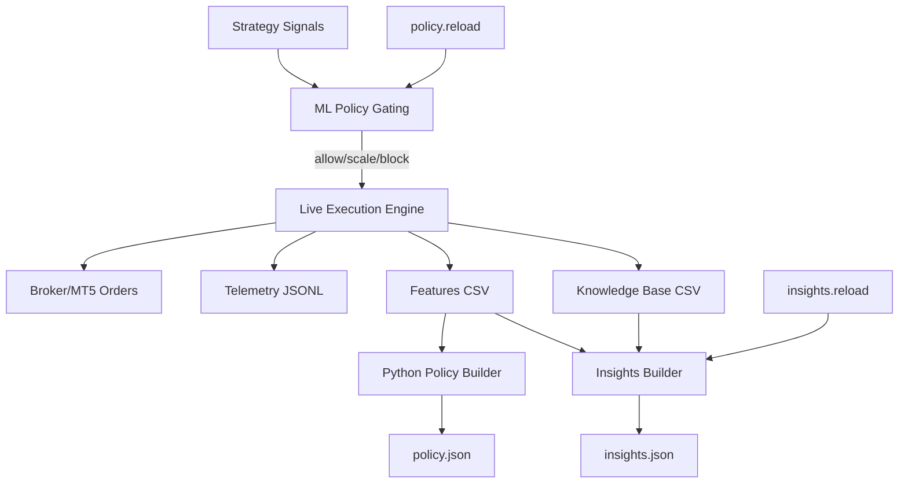

# LiveEA - DualEA Live Trading Expert Advisor

## Overview
LiveEA is the live-trading counterpart of DualEA, consuming insights and ML policy gating from `../PaperEA/PaperEA_v2.mq5`, with added live-safety guards. It executes real orders when the ML filter and risk checks permit.

Highlights:
- ML gating via `Common\Files\DualEA\policy.json` (loaded on init; restart required for updates)
- Insights auto-reload via `DualEA\insights.reload` request + `insights.ready` polling
- Telemetry stream to `Common\Files\DualEA\telemetry\live_*.jsonl`
- Optional PositionManager integration behind a flag (future work)

## Architecture

## File Map (relative)
- `../LiveEA/LiveEA.mq5` — main EA
- `../PaperEA/PaperEA_v2.mq5` — PaperEA (data collection reference)
- `../Include/` — shared utilities (InsightsLoader, Telemetry, KnowledgeBase)
- `../ML/` — Python scaffolding (`train.py`, `policy_export.py`)

## Common Files I/O
- `DualEA/policy.json` — gating probabilities and optional SL/TP/Trail scales
- `DualEA/insights.json` — insights used by heuristics/exploration
- `DualEA/knowledge_base.csv`, `DualEA/features.csv` — analytics/training
- `DualEA/telemetry/*.jsonl` — runtime telemetry
- `DualEA/policy.reload`, `DualEA/insights.reload` — control flags

## Key Behaviours
- `UsePolicyGating` governs gating and scaling; loads `policy.json` on `OnInit()` (restart required for policy changes)
- `OnTimer()` calls `CheckInsightsReload()` and `CheckInsightsReady()` for insights auto-reload
- Insights rebuild is requested via `InsightsAutoReload` + `Insights_IsStale()` but performed by external script (`Scripts/InsightsRebuild.mq5`)
- Neutral fallback when slices are missing if enabled by inputs

## Telemetry (Phase 5)
- `p5_refresh` — emitted after successful insights rebuild+reload in `Insights_RebuildAndReload()`. Details: `reason=<init|timer|reload> gate=<ok|fail> selector=<ok|fail|skipped>`.
- `p5_rescore` — emitted at start of timer-triggered rescoring in `EvaluateAndMaybeExecute(true)`. Details: `n=<strategy_count> spread=<points>`.
- `p5_selector_cfg` — emitted in `OnInit()` after selector is configured and loaded. Captures weights, recency, strict thresholds and load statuses: `w_pf,w_exp,w_wr,w_dd,recency,days,alpha,strict,th_min_trades,th_min_wr,th_min_exp,th_min_pf,th_max_dd,insights,recent`.

Standardized Phase 5 gating keys:
- `p5_mtf` — multi-timeframe confirmation gate
- `p5_underperf` — recent underperformance gate
  
Existing Phase 5 keys used elsewhere:
- `p5_corr`, `p5_stability`, `p5_auto_reenabled`, `p5_auto_tune`

## Quick Start
1. Compile `LiveEA.mq5` in MetaEditor.
2. Attach to a live/demo chart with file operations allowed.
3. Ensure `DualEA/policy.json` exists in Common Files (loaded on init; restart to update).
4. Monitor the Experts tab and `DualEA/telemetry` for gating/scaling decisions and order flow.

## ML Integration
- Trainer: `../ML/train.py` and `../ML/policy_export.py`
- Reads `DualEA/features.csv` and `DualEA/knowledge_base.csv`
- Writes `DualEA/policy.json` with `min_confidence` and slice entries per strategy/symbol/timeframe (LiveEA uses full per-slice policy gating with scaling)

## Position Manager (Planned)
- See `../Include/PositionManager.mqh`. Integrate behind a `UsePositionManager` input to control scaling, exits, correlation, and bracket logic.

## Maintenance
- Use `Scripts/ValidateInsights.mq5` to verify `insights.json` freshness and coverage
- Run `Scripts/InsightsRebuild.mq5` to rebuild insights; LiveEA will auto-reload when `insights.ready` appears
- Policy changes require EA restart (no hot-reload in LiveEA)

## See Also
- `../PaperEA/PaperEA_v2.mq5`
- `./PaperEA_README.md`
- `./CORE_IMPLEMENTATION_PLAN.md`
- `../ML/README.md`
