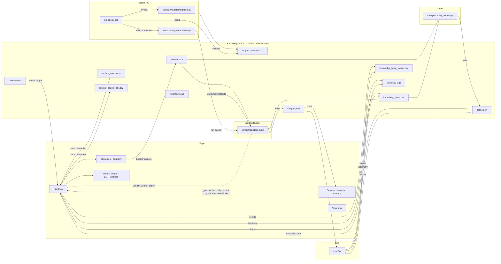

# Operations Guide (DualEA)

Practical procedures for managing DualEA runtime, knowledge base, policy reloads, and interpreting logs. All paths are under MT5 Common Files.

- Typical path: `C:\Users\<you>\AppData\Roaming\MetaQuotes\Terminal\Common\Files\DualEA\`
- Alternate: `C:\ProgramData\MetaQuotes\Terminal\Common\Files\DualEA\`

## Controls & Inputs (PaperEA)
- `NoConstraintsMode` — disable all gating and caps for maximum data collection (bypasses trading hours, selector gating, insights gating, exploration caps, and open-position limit). Default: `true`.
- `UsePolicyGating` — enable/disable ML policy gating
- `DefaultPolicyFallback` — allow neutral trading when slice/policy missing
- `FallbackDemoOnly` — restrict fallback to demo only (default true)
- `FallbackWhenNoPolicy` — allow fallback when no policy file is loaded (default true)
- `ExploreMaxPerSlice` — weekly cap (default 3; `0` = unlimited)
- `ExploreMaxPerSlicePerDay` — daily cap (default 2; `0` = unlimited)
- `MaxOpenPositions` — global open-position limit (default `0`; `0` = unlimited)
- `Verbosity` — controls `ShouldLog(level)` (INFO/DEBUG)

## Knowledge Base Files
- Trades: `knowledge_base.csv` (see `docs/KB-Schemas.md`)
- Events: `knowledge_base_events.csv`
- Features: `features.csv` (long format, includes `r_multiple` rows)
- Insights: `insights.json` (built via script or builder)
- Exploration counters: `explore_counts.csv`, `explore_counts_day.csv`

## System Flow

## Policy Lifecycle
- Location: `DualEA/policy.json`
- Reload trigger: touch `DualEA/policy.reload`
- The EA checks this in both `OnTimer()` and `OnTick()` (`CheckPolicyReload()`); when present, it reloads `policy.json`, logs `Policy reload signal detected: reloaded|failed`, and on success logs `Policy gating: min_conf=..., slices=N`.
- Loaded state: "loaded" iff one or more slices exist (slices > 0)
- Tracked via `ArraySize(g_pol_strat) > 0` in `PaperEA/PaperEA.mq5`

## Fallback Behavior
- When `UsePolicyGating=true`:
  - `fallback_no_policy`: if no policy is loaded and `FallbackWhenNoPolicy=true`
  - `fallback_policy_miss`: if policy loaded but the exact slice is missing
- Both paths:
  - Demo-only unless `FallbackDemoOnly=false`
  - Bypass insights thresholds and exploration caps
  - Neutral scaling (no SL/TP/trailing multipliers applied)
- Journal examples:
  - `FALLBACK: no policy loaded -> neutral scaling used for <strat> on <symbol>/<tf> demo=<true|false>`
  - `FALLBACK: policy slice missing -> neutral scaling used for <strat> on <symbol>/<tf> demo=<true|false>`

## Exploration Mode Management
- Purpose: allow limited trades to seed data for unseen slices.
- Counters:
  - Weekly file: `explore_counts.csv` (key,week_monday_yyyymmdd,count)
  - Daily file: `explore_counts_day.csv` (key,day_yyyymmdd,count)
- How counts advance:
  - On successful explore execution, EA increments and persists counters (`SaveExploreCounts*()`)
- Caps and gating logs:
  - Allow: `GATE: explore allow <strat> on <symbol>/<tf> reason=<...> (day=d/D, week=w/W) slice_exists=<true|false>`
  - Block: `GATE: blocked <strat> on <symbol>/<tf> reason=explore_cap_day|explore_cap_week ...`
- Reset counters:
  - Delete `explore_counts.csv` and/or `explore_counts_day.csv` from the Common Files folder
 - Notes:
   - Caps support `0 = unlimited` for both daily and weekly limits.
   - When `NoConstraintsMode=true`, insights gating and exploration caps are bypassed entirely.

## NoConstraintsMode (Data Collection Mode)
- Purpose: run PaperEA without constraints to maximize data collection for ML training.
- Behavior when `true`:
  - Bypasses: trading hours gate, selector gating, insights gating, exploration caps, and `MaxOpenPositions` guard.
  - Exploration caps accept `0 = unlimited`, but are ignored in this mode.
  - Startup log (INFO): `Mode: NoConstraintsMode=true -> bypass trading hours, selector gating, insights gating, exploration caps (0=unlimited), and MaxOpenPositions`.
- Recommended usage: PaperEA on demo/test for aggressive data harvesting. Not recommended for LiveEA.

## Rebuilding Insights
- Without re-running trades:
  - Run script `Scripts/InsightsRebuild.mq5` from MT5 Navigator
  - Inputs: `InFeaturesPath = "DualEA\\features.csv"`
  - Output: `DualEA/insights.json`
  - Logs: `InsightsRebuild: starting rebuild from features.csv ...`

## Troubleshooting & Common Messages
- Policy reload cannot open: `Policy gating: cannot open DualEA\policy.json (Common). Err=<code>`
- Policy reload detected: `Policy reload signal detected: reloaded|failed`
- Reload cleanup warning (non-fatal): `Policy reload: cannot delete signal file DualEA\policy.reload (err=<code>)`
- Cache loads:
  - `Insights gating cache load: ok|fail`
  - `Policy gating cache load: ok|fail`
  - `Explore counters loaded: week=ok|fail day=ok|fail`
- Execution blocks:
  - `EXEC: blocked <strat> on <symbol>/<tf> due to MaxOpenPositions=<N>` (only when `MaxOpenPositions > 0`; set to `0` to disable. Default: `0`)
- Scan/gate summaries:
  - `[SCAN] <symbol> tf=<tf> time=<ts> strats=<N> spread_pts=<x>`
  - `[STRAT] <name> p_win=<prob>`
  - `[GATE] 
`

## Maintenance Procedures
- Reset exploration only:
  - Delete `explore_counts.csv` and/or `explore_counts_day.csv`
- Full KB reset (dangerous, wipes history):
  - Delete `knowledge_base.csv`, `knowledge_base_events.csv`, `features.csv`, `insights.json`
- Force policy refresh from trainer:
  - Run `ML/run_train_and_export.bat` (writes `policy.json`, touches `policy.reload`)

## Safety Notes
- Fallback trades are neutral and do not consume exploration quotas
- File I/O uses `FILE_COMMON`; ensure your MT5 has write permissions to the Common Files directory
- Some readers use `FILE_ANSI` and plain text parsing — avoid altering CSV delimiters/headers

## Artifact Rotation & Compression
- All major artifacts (features.csv, insights.json, scaler.pkl, tf_model.keras, features.json) are automatically rotated if they exceed operational size limits.
- **features.csv** (MQL5): If file exceeds 100MB, it is renamed with a timestamped `.bak` suffix before new data is written. No compression (MQL5 limitation).
- **ML artifacts** (Python):
  - `tf_model.keras`: Rotated if above 100MB (no compression).
  - `scaler.pkl`, `features.json`: Rotated and compressed with gzip if above 20MB.
  - Old files are preserved with a timestamped `.bak` (and `.gz` for compressed).
- Rotation occurs before each new write session.

## Trade Execution Retry Policy
- All trade executions (market, stop, limit) are guarded with a retry loop for transient broker errors (requote, busy, timeout, etc.).
- Up to 3 attempts are made, with a short sleep between retries.
- Each failure and retry is logged with error code, attempt number, and time.
- Non-retryable errors abort further attempts immediately.

## Insights Rebuild Timeout
- The InsightsRebuild script now accepts a `TimeoutMs` input (default: 60,000 ms).
- The feature scan is chunked and logs progress every 1000 rows, with a brief sleep to avoid watchdog timeouts.
- If the timeout is exceeded, the rebuild aborts and logs the row/time boundary.
