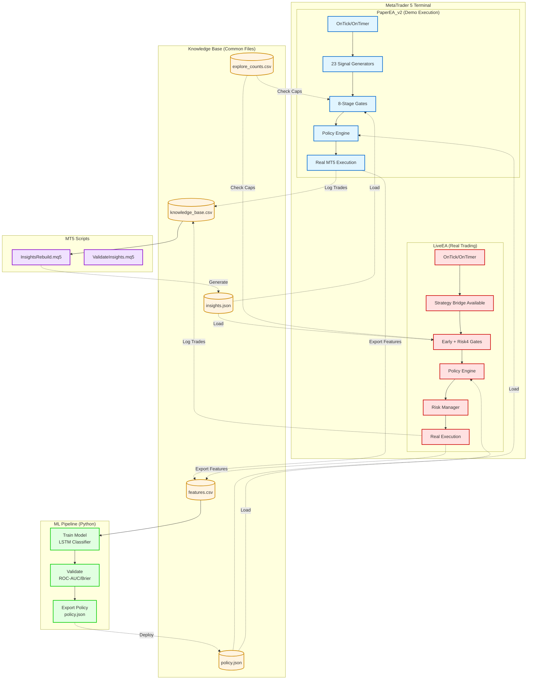
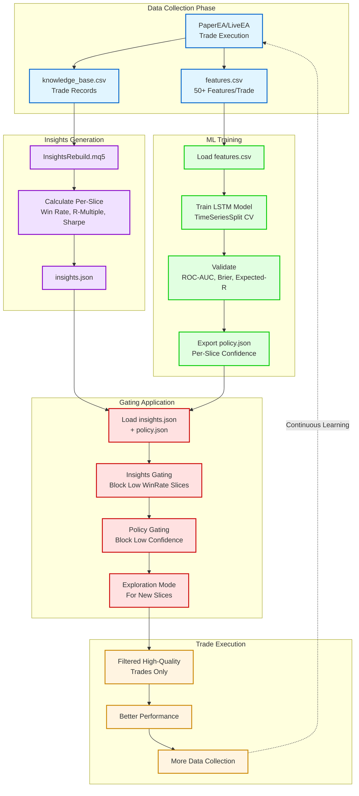

# DualEA — Production Multi-Strategy Trading System

**Paper EA + Live EA with ML Policy Engine**

---

## Registries & Factories

- Strategy registry: `Include/Strategies/Registry.mqh` lists default strategies by name.
- Strategy factory: `Include/StrategyFactory.mqh` creates `IStrategy*` by name.
- Gate registry: `Include/GateRegistry.mqh` lists gates and creates `IGate*` by name.

Usage pattern (EA-level):

```cpp
#include "Include/Strategies/Registry.mqh"
#include "Include/StrategyFactory.mqh"
#include "Include/GateRegistry.mqh"

string names[]; GetDefaultStrategyNames(names);
IStrategy *active[]; ArrayResize(active, ArraySize(names));
for(int i=0;i<ArraySize(names);++i)
  active[i] = CreateStrategyByName(names[i], _Symbol, (ENUM_TIMEFRAMES)_Period);

string gates[]; GetDefaultGateNames(gates);
// Use CreateGateByName(...) to build a custom gate pipeline if needed.
```

Hot-reload suggestion:

- On `OnTimer()` detect updated config → rebuild strategy list or gate pipeline by name.
- Use `ConfigManager` for gate enable/threshold updates.

---

## Quick Navigation

**New to DualEA?** Start here:
1. [System Overview](#system-overview) - What is DualEA?
2. [Quick Start](#quick-start) - Get up and running
3. [Architecture](#architecture) - How it works

**Setting up?** Check these guides:
- [Configuration-Reference.md](Configuration-Reference.md) - All 180+ parameters explained
- [Execution-Pipeline.md](Execution-Pipeline.md) - Understand the trade flow

**Troubleshooting?** Go to:
- [Policy-Exploration-Guide.md](Policy-Exploration-Guide.md) - Policy and exploration issues
- [Appendices.md](Appendices.md) - Troubleshooting guide and operational procedures

**Developing?** See:
- [Phase-Implementation.md](Phase-Implementation.md) - Development roadmap and TODOs
- [Observability-Guide.md](Observability-Guide.md) - Telemetry and monitoring

---

## System Overview

**DualEA** is a production-ready Expert Advisor ecosystem for MetaTrader 5:

- **PaperEA_v2**: Executes real MT5 orders on a demo account for data collection, gating validation, and ML/ONNX integration.
- **LiveEA**: Executes real MT5 orders with a risk/insights/policy gating scaffold and an insights auto-reload watcher.
- **ML Pipeline**: TensorFlow/Keras training with policy export
- **Knowledge Base**: Shared CSV/JSON data in Common Files

### System Architecture



### Execution Pipeline Flow


### Data Flow & Learning Loop



---

## Quick Start

```bash
# 1. Run PaperEA for data collection
# Load PaperEA/PaperEA_v2.mq5 on charts (EURUSD H1, GBPUSD H1, etc.)
# Set NoConstraintsMode=true for maximum data collection

# 2. Generate insights from collected data
# Run Scripts/InsightsRebuild.mq5 to create insights.json

# 3. Train ML model and export policy
cd ML
run_train_and_export.bat

# 4. Deploy LiveEA with policy
# Load LiveEA/LiveEA.mq5 on charts
# Set UsePolicyGating=true and UseInsightsGating=true
```

---

## Implementation Status

### Production Ready

**PaperEA_v2**
- 8-stage unified gate system (ConfigManager, EventBus, SystemMonitor)
- 23 strategies with asset-class registry  
- Real MT5 orders on demo for data collection and ML/ONNX integration
- Advanced optimizers: AdaptiveSignalOptimizer, PolicyUpdater, PositionReviewer, GateLearningSystem
- Knowledge Base with 100MB rotation, UnifiedTradeLogger with daily JSON logs
- 180+ input parameters for fine-tuning

**LiveEA**
- Insights gating (win rate, trades, R-multiple thresholds)
- ML policy gating (confidence, SL/TP/trail scaling)
- Risk management (spread, session, daily loss, drawdown, margin, consecutive losses)
- News filtering, exploration mode, position/session/correlation/volatility managers

**ML Pipeline**
- TensorFlow/Keras training with TimeSeriesSplit validation
- Policy export with slice-based probabilities
- Yahoo Finance enrichment, 50+ features
- Automatic rotation and compression

**Supporting Systems**
- InsightsRebuild: One-click insights.json generation
- Test suite: 8 integration/unit tests
- Build scripts and CI hooks

### Partial / Planned

- Policy hot-reload via .reload triggers
- LSTM sequence validation
- Multi-timeframe confirmation gate (P5_MTFConfirmEnable)
- Timer-based minutely scanning (Phase 6)
- Advanced correlation pruning algorithms

---

## Architecture

### 23 Active Strategies

**Trend (5):** ADX, SuperTrendADXKama, DonchianATRBreakout, ForexTrend, Alligator  
**Mean Reversion (4):** BollAverages, MeanReversionBB, RSI2BBReversion, VWAPReversion  
**Momentum (6):** AwesomeOscillator, AcceleratorOscillator, BearsPower, BullsPower, KeltnerMomentum, Aroon  
**Multi-Asset (3):** GoldVolatility, IndicesEnergies, OpeningRangeBreakout  
**Advanced (5):** MultiIndicator, EMAPullback, Stub, StochasticOscillator, IchimokuCloud  

Strategies auto-selected via asset-class registry (FX Major/Minor, Crypto, Metal, Energy, Index).

### 8-Stage Gate System

1. **Signal Rinse**: Basic validation, confidence filtering
2. **Market Soap**: Volatility, correlation, regime analysis
3. **Strategy Scrub**: Strategy-specific validation
4. **Risk Wash**: Position sizing, risk validation
5. **Performance Wax**: Backtest performance checks
6. **ML Polish**: ML confidence scoring
7. **Live Clean**: Live market conditions
8. **Final Verify**: Pre-execution validation

Each gate: individually configurable, learning-based auto-tuning, shadow logging support.

### Data Flow

```
PaperEA → features.csv, knowledge_base.csv
         ↓
      InsightsRebuild.mq5
         ↓
      insights.json
         
features.csv → ML/train.py → policy.json

policy.json + insights.json → LiveEA → Real Trades → knowledge_base.csv
```

### Common Files Structure

```
Common/Files/DualEA/
├── features.csv               # ML training data (100MB rotation)
├── knowledge_base.csv         # Trade records
├── knowledge_base_events.csv  # Trade events
├── insights.json              # Performance per strategy/symbol/TF
├── policy.json                # ML policy with confidence thresholds
├── policy.backup.json         # Rollback cache
├── explore_counts.csv         # Weekly exploration tracking
├── explore_counts_day.csv     # Daily exploration tracking
└── logs/trades_YYYYMMDD.json  # Daily trade logs
```

---

## Configuration

### Key PaperEA Parameters

**Trading**: `LotSize`, `MagicNumber`, `StopLossPips`, `TakeProfitPips`, `MaxOpenPositions`, `TrailEnabled`  
**Gating**: `UseInsightsGating`, `UseExploration`, `UsePolicyGating`, `NoConstraintsMode`  
**Exploration**: `ExploreMaxPerSlicePerDay` (default 100), `ExploreMaxPerSlice` (default 100)  
**Policy Fallback**: `DefaultPolicyFallback`, `FallbackDemoOnly`, `FallbackWhenNoPolicy`  
**Risk**: Circuit breakers, news filters, regime gates, session limits  

**NoConstraintsMode=true** (default in PaperEA_v2): Bypasses many constraints for data collection, but critical safety checks (e.g., circuit breaker and resource guards) still run.

### Key LiveEA Parameters

Inherits PaperEA params plus:

**Insights Thresholds**: Min win rate, total trades, avg R-multiple  
**Policy Thresholds**: Min confidence, scaling multipliers  
**Risk Limits**: Max spread, daily loss %, drawdown %, margin level, consecutive losses  
**PositionManager**: `UsePositionManager`, `PM_EnableCorrelationSizing`, `PM_ScalingProfile`

---

## Execution Pipeline

1. **Early safety & filters** → circuit breaker/memory/news (PaperEA) and risk/spread/session/news (LiveEA)
2. **Strategy selection** → PaperEA selector scoring; LiveEA is designed for an external orchestrator (strategy bridge exists)
3. **Signal generation** → PaperEA 23 indicator signal generators; LiveEA strategy bridge is not called from `OnTick()`
4. **Gating** → PaperEA 8-stage GateManager; LiveEA early + risk4 gates
5. **Insights/policy gating** → LiveEA uses per-slice policy + insights gating; PaperEA policy load is currently minimal
6. **Execution** → `CTradeManager::ExecuteOrder()`
7. **Post execution** → KB logging, features export, telemetry, learning updates

---

## Exploration Mode

**Purpose**: Bootstrap insights for new strategy/symbol/TF slices.

**Rules**:
- Bypass ONLY when NO slice exists (no-slice-only)
- If slice exists but fails thresholds → BLOCKED
- Daily cap: `ExploreMaxPerSlicePerDay` (default 100)
- Weekly cap: `ExploreMaxPerSlice` (default 100)
- Counters persist in `explore_counts*.csv`

**NoConstraintsMode**: Bypasses insights gating AND exploration caps entirely.

**Logs**:
```
GATE: explore allow ADXStrategy on EURUSD/H1 (day=1/2, week=2/3)
GATE: blocked ADXStrategy reason=explore_cap_day (day=2/2)
```

**Reset**: Delete `explore_counts.csv` and `explore_counts_day.csv`.

---

## Policy Fallback

**When**: `UsePolicyGating=true` but policy missing or incomplete.

**Fallback Modes**:

1. **No Policy** (`fallback_no_policy`): policy.json not loaded (slices=0)
2. **Policy Miss** (`fallback_policy_miss`): policy loaded but slice missing

**Behavior**:
- Demo-only by default (`FallbackDemoOnly=true`)
- Neutral scaling (no SL/TP/trail multipliers)
- Bypasses insights/exploration caps
- Safe for data collection

**Logs**:
```
FALLBACK: no policy loaded -> neutral scaling for ADXStrategy on EURUSD/H1 demo=true
FALLBACK: policy slice missing -> neutral scaling for BollAverages on GBPUSD/H1 demo=true
```

**Production**: Set `FallbackDemoOnly=false` carefully or disable fallbacks entirely.

---

## ML Pipeline

### Training

```bash
cd ML
python train.py --input ../../../Common/Files/DualEA/features.csv --output artifacts/
```

- TimeSeriesSplit validation (5 splits)
- LSTM + Dense classifier
- Yahoo Finance enrichment
- ROC-AUC, Brier, Expected-R metrics

### Policy Export

```bash
python policy_export.py --model artifacts/tf_model.keras --scaler artifacts/scaler.pkl --output policy.json
```

- Per-slice probability estimates
- Confidence thresholds
- SL/TP/trail scaling multipliers
- Provenance metadata (model hash, train window, metrics)

### Deployment

- **LiveEA** loads `policy.json` on `OnInit()`; policy changes typically require a restart.
- **PaperEA_v2** supports `DualEA\policy.reload` (Common Files) to trigger `Policy_Load()` and also polls HTTP/file at a timer cadence.

---

## Policy Server (Local HTTP)

Run a minimal local HTTP server to serve `policy.json` for hot-reload via `WebRequest`.

```bash
cd MQL5/Experts/Advisors/DualEA/python
python policy_server.py --host 127.0.0.1 --port 5005 --policy "%APPDATA%/MetaQuotes/Terminal/Common/Files/DualEA/policy.json"
```

- Endpoints:
  - `/policy.json` → returns the policy file contents
  - `/policy/version` → returns `{ hash, size }` metadata for change detection

- MT5 WebRequest whitelist:
  - Tools → Options → Expert Advisors → Allow WebRequest for listed URL
  - Add: `http://127.0.0.1:5005`

- PaperEA Settings:
  - `PolicyServerUrl` (base URL, e.g. `http://127.0.0.1:5005`)
  - `PolicyHttpPollPercent` (rate-based split between HTTP and file polling)
  - `HotReloadIntervalSec` (default 10s)

Hot-reload flow (PaperEA_v2): on timer/maintenance, PaperEA rolls a percentage to decide HTTP vs file polling.

---

## Monitoring & Telemetry

### Event Types

- `gate_decision`: Pass/block with reason and latency
- `trade_execution`: Trade placements
- `policy_load`: Policy reload events
- `insights_rebuild`: Insights regeneration
- `threshold_adjust`: Learning-based adjustments
- `risk4_*`: Risk gate events (spread, margin, drawdown)
- `pm_*`: PositionManager events (correlation sizing)
- `p5_*`: Selector events (refresh, rescore, tune)

### SystemMonitor

- Gate success rates per stage
- Processing latency (gate, total pipeline)
- System health score (0-100)
- Memory and handle tracking

### Telemetry Export

CSV/JSON format:
```csv
timestamp,event_type,symbol,timeframe,strategy,gate,result,reason,latency_ms,metadata
```

---

## Testing

### Test Suite

Run from `Tests/`:
- `Test_Integration.mq5`: End-to-end pipeline
- `Test_GateManager.mq5`: Gate logic validation
- `Test_UnifiedSystem.mq5`: ConfigManager/EventBus/SystemMonitor
- `Test_PositionManager.mq5`: Position management
- `Test_SessionManager.mq5`: Session controls
- `Test_CorrelationManager.mq5`: Correlation logic
- `Test_VolatilitySizer.mq5`: Volatility sizing
- `Test_SystemHealth.mq5`: Health monitoring

### Validation

```bash
# Validate insights.json
run Scripts/ValidateInsights.mq5

# Rebuild insights
run Scripts/InsightsRebuild.mq5
```

---

## Documentation

### Core Documentation
- **README_PRODUCTION.md**: This file (quick reference)
- **README.md**: Original comprehensive README with full phase details

### Detailed Guides
- **[Configuration-Reference.md](Configuration-Reference.md)**: Complete guide to all 180+ input parameters, configuration patterns, and best practices
- **[Execution-Pipeline.md](Execution-Pipeline.md)**: Detailed execution flow from signal generation through post-execution, including paper vs live trading
- **[Observability-Guide.md](Observability-Guide.md)**: Telemetry system, event types, SystemMonitor, debugging techniques, and performance monitoring
- **[Policy-Exploration-Guide.md](Policy-Exploration-Guide.md)**: ML policy gating, fallback modes, exploration system, and troubleshooting
- **[Phase-Implementation.md](Phase-Implementation.md)**: Complete roadmap for Phases 1-11 with status, TODOs, and implementation priorities
- **[Appendices.md](Appendices.md)**: Red-team artifacts, data schemas, CI/CD integration, operational procedures, and troubleshooting

### Legacy Documentation
- **UnifiedSystemGuide.md**: ConfigManager/EventBus/SystemMonitor integration
- **KB-Schemas.md**: CSV/JSON schemas
- **PolicySchema.md**: policy.json structure
- **Phase3.md**: LiveEA implementation plan
- **Operations.md**: Ops runbook
- **DualEA_Handbook.md**: Comprehensive handbook

---

## Development Roadmap

See detailed phase documentation in original README.md:

- **Phase 1**: Data & Insights Foundation ✅
- **Phase 2**: ML/LSTM Pipeline ✅  
- **Phase 2a**: PaperEA Execution & Telemetry ✅
- **Phase 3**: LiveEA & Feedback Loop ✅ (hardening in progress)
- **Phase 4**: Risk & Safety Systems ✅
- **Phase 5**: Dynamic Strategy Selection 🔄
- **Phase 6**: Low-Latency Scanner 🔄
- **Phase 7**: Monitoring & Telemetry 🔄
- **Phase 8**: Adversarial Hardening 📋
- **Phase 9**: MLOps & Continuous Training 📋
- **Phase 10**: Multi-Symbol Orchestration 📋
- **Phase 11**: Performance & Resilience 📋

---

## License

Copyright 2025, Windsurf Engineering.

---

## Support

For detailed implementation guidance, see the full README.md and documentation in `docs/`.
