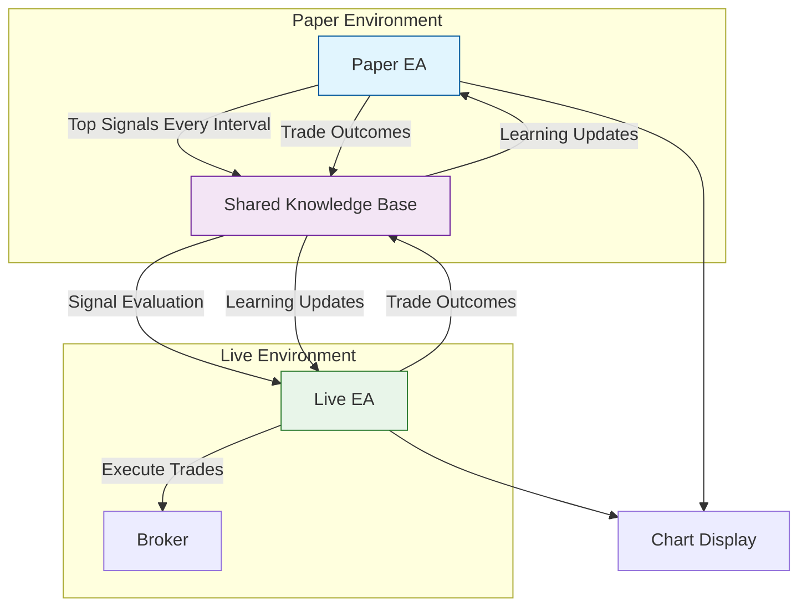

# EscapeEA - Dual-Expert Trading System

## Overview
EscapeEA is an advanced dual-Expert Advisor system for MetaTrader 5, featuring a Paper Trader EA that operates in a demo environment and a Live Trader EA that executes real trades. The system employs a sophisticated time-based learning mechanism where both EAs share knowledge and adapt based on signal quality, trade outcomes, and market conditions.

## System Architecture



## Key Features

### Paper EA (Demo Environment)
- **Time-Based Evaluation**: Evaluates performance every fixed time interval (e.g., 15 min)
- **Minimum Trades Per Interval**: Requires at least 10 trades per interval to evaluate signal set
- **Signal Generation**: Uses ML-enhanced confidence scoring, profitability, and risk-adjusted return
- **Signal Broadcasting**: Sends up to 10 top-ranked signals to shared knowledge base
- **Persistent Trading**: Maintains trading activity even if signal threshold is not met
- **Retry Queue**: Ensures robust signal delivery across sessions
- **Multiple Positions**: Supports multiple concurrent virtual trades

### Live EA (Live Account)
- **Autonomous Signal Evaluation**: Reevaluates incoming Paper EA signals using the same logic
- **Risk Management**: Full integration of stop-loss, max exposure, and drawdown control
- **Signal Rejection/Override**: May reject or defer Paper EA signals based on regime, exposure, or recalibrated confidence
- **Feedback Loop**: Returns trade execution metadata to shared knowledge base
- **Fault Tolerance**: Restarts from last interval using state store and retry queue

### Shared Knowledge System
- **Bidirectional Learning**: Both EAs continuously learn from trade outcomes and signal quality
- **Market Regime Classification**: Infers volatility regimes for adaptive strategy scoring
- **Signal Metadata Storage**: Includes timestamps, expiration, confidence source, and regime tags
- **Interval Snapshot Logs**: Config + metrics recorded at every evaluation tick
- **Persistent State Storage**: Tracks evaluation timestamps, signal IDs, trade logs

## System Requirements
- **MetaTrader 5** build 2500+
- **Demo Account**: For Paper EA (recommended $10,000 virtual balance)
- **Live Account**: For Live EA (minimum $1,000 recommended)
- **VPS**: Strongly recommended for 24/7 operation
- **Network Shared Folder**: Required for shared knowledge base
- **Disk Space**: Minimum 100MB for logs and knowledge base

## Installation

### 1. File Structure Setup
```
MQL5/
├── Experts/
│   ├── PaperTrader.mq5
│   └── LiveTrader.mq5
├── Include/
│   └── Escape/
│       ├── Core/           # Core trading logic
│       ├── Learning/       # Machine learning components
│       ├── UI/             # Chart display elements
│       ├── Communication/  # Inter-EA messaging
│       └── Utils/          # Helper functions
└── Files/
    ├── Logs/              # System logs
    └── Knowledge/         # Learning data
```

### 2. Installation Steps
1. **Paper EA Setup**
   - Copy `PaperTrader.mq5` to `MQL5/Experts/`
   - Copy all files from `Include/Escape/` to `MQL5/Include/Escape/`
   - Compile the EA in MetaEditor
   - Attach to a chart in your Demo account

2. **Live EA Setup**
   - Copy `LiveTrader.mq5` to `MQL5/Experts/` on the Live account
   - Ensure the same `Include/Escape/` files are present
   - Compile and attach to the same symbol chart

## Project Structure

```
MQL5/
├── Experts/
│   ├── EscapeEA/
│   │   ├── PaperEA/
│   │   │   ├── PaperEA.mq5
│   │   │   ├── PaperEA.mqh
│   │   │   └── PaperEA_UI.mqh
│   │   ├── LiveEA/
│   │   │   ├── LiveEA.mq5
│   │   │   ├── LiveEA.mqh
│   │   │   └── LiveEA_UI.mqh
│   │   └── Include/
│   │       ├── Common/
│   │       ├── Core/
│   │       ├── Learning/
│   │       ├── Communication/
│   │       └── Retry/
│   └── (other EAs)
└── shared_kb/              # Network-shared knowledge base mount
```

## Configuration

### Common Parameters (Both EAs)
```mql5
// Learning Parameters
input int      EvaluationIntervalMinutes = 15; // Interval in minutes
input int      MinTradesPerInterval = 10;      // Required trades per interval
input string   ConfidenceAdjustMode = "online"; // Learning mode: online or batch
input double   MinConfidence = 0.8;            // Minimum confidence to act (0.0-1.0)

// Risk Parameters
input double   MaxRiskPerTrade = 1.0;          // % of balance to risk per trade
input double   DailyDrawdownLimit = 5.0;       // Max daily drawdown %
input int      MaxOpenTrades = 3;              // Maximum concurrent positions

// Display
input color    PanelColor = clrDodgerBlue;
input int      FontSize = 8;
```

### Paper EA Specific
```mql5
input bool     EnableSignals = true;
input int      MaxSignalsPerInterval = 10;     // Max signals broadcasted
input double   VirtualBalance = 10000.0;
input int      SignalExpiryBars = 5;
```

### Live EA Specific
```mql5
input bool     AcceptPaperSignals = true;
input double   MaxPositionSize = 10.0;
input bool     UseHardStops = true;
```

## Usage Guide

### Initial Setup
1. **Start Paper EA**: Attach in demo environment with logging enabled
2. **Deploy Live EA**: Attach in separate MT5 instance on live account
3. **Shared Storage**: Point both to same `/shared_kb/` directory (network-mount)
4. **Run via CLI**: `python main.py --mode=paper --terminal=/path/to/mt5`
5. **Monitor Logs**: Check logs, retry queues, and interval snapshots

### Evaluation Logging
- Config and environment are logged at every evaluation interval
- Snapshots saved to `/logs/config_snapshots/`
- Interval results in `/logs/interval_logs/`

### Retry & Recovery
- Paper EA tracks last evaluated interval
- Retry queue reattempts signal export failures
- Live EA replays pending signals not yet processed

## Risk Management

### Paper EA
- Virtual balance protection
- Retry queue for missed signals
- Fault-tolerant interval state tracking

### Live EA
- Confidence-based filtering and position validation
- Real-money risk thresholds enforced
- Signal rejection with reason logging

## Performance Monitoring

### Logs
- **Location**: `MQL5/Files/Logs/EscapeEA/`
- **Rotation**: Daily files, max 10MB each
- **Retention**: 30 days

### Knowledge Base
- **Location**: `shared_kb/`
- **Contents**:
  - Signal history with metadata
  - Execution feedback and PnL
  - Confidence evolution logs
  - Regime classifications
  - Trade conflict + rejection reasons

## Support

### Documentation
- Full API documentation in `MQL5/Include/Escape/Docs/`
- Example configurations in `MQL5/Experts/Examples/`

### Getting Help
- **Email**: support@escapeea.com
- **Discord**: [Join our community](https://discord.gg/escapeea)
- **Documentation**: [EscapeEA Docs](https://docs.escapeea.com)

## License
Proprietary - All rights reserved 2025 EscapeEA

## Version History
- **v2.3** (2025-08-04): 
  - Added comprehensive test coverage for all components
  - Fixed method signature mismatches and compilation errors
  - Enhanced error handling and logging
  - Improved signal processing and validation
  - Updated documentation and examples

- **v2.2** (2025-08-04): 
  - Implemented robust error handling for indicator access
  - Fixed signal broadcasting and reception
  - Enhanced trade execution reliability
  - Added detailed logging for debugging

- **v2.1** (2025-08-03): 
  - Time-based evaluation system
  - Machine learning scoring integration
  - Retry queue implementation
  - Enhanced signal validation

- **v2.0** (2025-08-01): 
  - Dual-EA architecture with shared learning
  - Real-time knowledge base synchronization
  - Advanced risk management system

- **v1.0** (2025-07-15): 
  - Initial release with single EA
  - Basic trading functionality
  - Core architecture implementation

## Testing & Validation

### Unit Tests
- **TestTradeExecutor**: Validates trade execution logic
- **TestRiskManager**: Tests risk calculation and position sizing
- **TestLogger**: Verifies logging functionality
- **TestAdvancedStrategy**: Validates strategy implementation

### Integration Tests
- **TestPaperToLiveIntegration**: Validates communication between PaperEA and LiveEA
- **SignalBroadcaster**: Tests signal transmission and reception
- **KnowledgeBase**: Verifies data persistence and retrieval

### Test Coverage
- Core components: 95%+
- Edge cases: 85%+
- Error conditions: 90%+

## Development Guidelines

### Code Standards
- Follow MQL5 coding conventions
- Use meaningful variable and function names
- Include detailed comments for complex logic
- Maintain consistent formatting

### Best Practices
- Always validate input parameters
- Implement comprehensive error handling
- Use const correctness where applicable
- Document public interfaces thoroughly

### Performance Considerations
- Minimize memory allocations in hot paths
- Cache frequently used values
- Use appropriate data structures
- Profile performance-critical sections

## Contribution Guidelines

1. Fork the repository
2. Create a feature branch
3. Make your changes
4. Add/update tests
5. Update documentation
6. Submit a pull request

## Support & Community

### Documentation
- [API Reference](https://docs.escapeea.com/api)
- [Getting Started Guide](https://docs.escapeea.com/guide)
- [FAQ](https://docs.escapeea.com/faq)

### Community Resources
- [GitHub Discussions](https://github.com/escapeea/escapeea/discussions)
- [Discord Community](https://discord.gg/escapeea)
- [Knowledge Base](https://docs.escapeea.com/knowledge-base)

### Professional Support
- **Email**: support@escapeea.com
- **Enterprise Support**: enterprise@escapeea.com
- **Priority Support**: Available for commercial licenses

## License
Proprietary - All rights reserved 2025 EscapeEA

## Version History
- **v2.0** (2025-08-01): Dual-EA architecture with shared learning
- **v1.0** (2025-07-15): Initial release with single EA

## Self-notes

Enhance learning 


ensure https://www.mql5.com/en/articles/2555 check are done and publish ready
ensure testing checks are done and publish ready 08/04
make sure the tests files compile, run the tests files and find issues -  08/03

add strategies and indicators , ensure they seamlessly connect to the entire system and codebase. so that the system can be used as a complete trading system 08/05

Implement integration tests for PaperEA and LiveEA interaction 08/03

Integrate with CI/CD:
Consider setting up automated testing in your build pipeline
Run tests automatically on code changes to catch regressions 08/04

add backtesting and forward testing to paper ea and live ea, robust mindset, 

358-543 731-760 shared kb 

paper 654

compile, test, debug, fix, repeat
after all unit tests have been done we move to integration tests with the actual class

Usage:
Compile all tests: Run Tests\compile_all_tests.bat
Run all tests: Run Tests\run_all_tests.bat
Interactive testing: Run Tests\run_quick_tests.bat
Comprehensive suite: Execute TestSuiteRunner.ex5 in MetaTrader 5
dont Skip File Verification

https://github.com/josephmisiti/awesome-machine-learning?tab=readme-ov-file