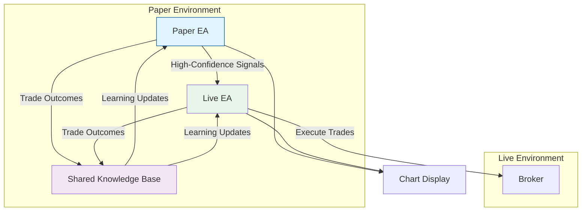

# EscapeEA - Dual-Expert Trading System

## Overview
EscapeEA is an advanced dual-Expert Advisor system for MetaTrader 5, featuring a Paper Trader EA that operates in a demo environment and a Live Trader EA that executes real trades. The system employs a sophisticated learning mechanism where both EAs share knowledge and learn from each other's performance.

## System Architecture



## Key Features

### Paper EA (Demo Environment)
- **Signal Generation**: Advanced technical analysis with confidence scoring
- **Virtual Trading**: Realistic trade simulation with virtual balance
- **Performance Validation**: Must complete minimum 20 trades before evaluation
- **Signal Broadcasting**: Only sends signals after achieving ≥80% win rate in last 20 trades
- **Continuous Monitoring**: Re-evaluates performance every 20 trades
- **Multiple Positions**: Can maintain multiple open positions simultaneously

### Live EA (Live Account)
- **Signal Validation**: Verifies incoming signals from Paper EA
- **Risk Management**: Implements position sizing and risk controls
- **Live Execution**: Handles real market order execution
- **Multiple Positions**: Can maintain multiple open positions simultaneously
- **Performance Tracking**: Monitors and logs all trade outcomes
- **Trade Verification**: Confirms Paper EA maintains required performance

### Shared Knowledge System
- **Bidirectional Learning**: Both EAs learn from each other's trades
- **Persistent Storage**: Maintains trade history and learning parameters
- **Performance Analytics**: Trades are analyzed for continuous improvement

## System Requirements
- **MetaTrader 5** build 2500+
- **Demo Account**: For Paper EA (recommended $10,000 virtual balance)
- **Live Account**: For Live EA (minimum $1,000 recommended)
- **VPS**: Strongly recommended for 24/7 operation
- **Disk Space**: Minimum 100MB for logs and knowledge base

## Installation

### 1. File Structure Setup
```
MQL5/
├── Experts/
│   ├── PaperTrader.mq5
│   └── LiveTrader.mq5
├── Include/
│   └── Escape/
│       ├── Core/           # Core trading logic
│       ├── Learning/       # Machine learning components
│       ├── UI/             # Chart display elements
│       ├── Communication/  # Inter-EA messaging
│       └── Utils/          # Helper functions
└── Files/
    ├── Logs/              # System logs
    └── Knowledge/         # Learning data
```

### 2. Installation Steps
1. **Paper EA Setup**
   - Copy `PaperTrader.mq5` to `MQL5/Experts/`
   - Copy all files from `Include/Escape/` to `MQL5/Include/Escape/`
   - Compile the EA in MetaEditor
   - Attach to a chart in your Demo account

2. **Live EA Setup**
   - Copy `LiveTrader.mq5` to `MQL5/Experts/` on the Live account
   - Ensure the same `Include/Escape/` files are present
   - Compile and attach to the same symbol chart

## Project Structure

```
MQL5/
├── Experts/
│   ├── EscapeEA/                   # Main project directory
│   │   ├── PaperEA/                # Paper Trading EA
│   │   │   ├── PaperEA.mq5         # Main EA file
│   │   │   ├── PaperEA.mqh         # Core paper trading logic
│   │   │   └── PaperEA_UI.mqh      # UI components
│   │   │
│   │   ├── LiveEA/                 # Live Trading EA
│   │   │   ├── LiveEA.mq5          # Main EA file
│   │   │   ├── LiveEA.mqh          # Core live trading logic
│   │   │   └── LiveEA_UI.mqh       # UI components
│   │   │
│   │   └── Include/                # Shared include files
│   │       ├── Common/             # Common definitions
│   │       │   ├── Enums.mqh       # Enumerations
│   │       │   ├── Structs.mqh     # Data structures
│   │       │   └── Constants.mqh   # Global constants
│   │       │
│   │       ├── Core/               # Core trading components
│   │       │   ├── SignalGenerator.mqh  # Signal generation
│   │       │   ├── RiskManager.mqh      # Risk management
│   │       │   └── TradeExecutor.mqh    # Order execution
│   │       │
│   │       ├── Learning/           # Learning components
│   │       │   ├── LearningEngine.mqh   # ML logic
│   │       │   └── KnowledgeBase.mqh    # Persistent storage
│   │       │
│   │       └── Communication/      # Inter-EA communication
│   │           ├── SignalBroadcaster.mqh  # Signal sending
│   │           └── SignalReceiver.mqh     # Signal handling
│   │
│   └── (other EAs)
│
└── (other MQL5 directories)
```

### Data Storage
- **Logs**: `MQL5/Files/Logs/EscapeEA/`
- **Knowledge Base**: `MQL5/Files/Knowledge/EscapeEA/`
- **Configuration**: `MQL5/Profiles/`

## Configuration

### Common Parameters (Both EAs)
```mql5
// Learning Parameters
input int      LearningWindow = 20;     // Trades to analyze for learning
input double   MinConfidence = 0.8;     // Minimum confidence to act (0.0-1.0)
input int      MaxTradesPerDay = 5;     // Maximum trades per 24h

// Risk Parameters
input double   MaxRiskPerTrade = 1.0;   // % of balance to risk per trade
input double   DailyDrawdownLimit = 5.0; // Max daily drawdown %
input int      MaxOpenTrades = 3;       // Maximum concurrent positions

// Display
input color    PanelColor = clrDodgerBlue;  // Panel color
input int      FontSize = 8;               // Chart font size
```

### Paper EA Specific
```mql5
// Performance Requirements
input int      MinTradesForEvaluation = 20;  // Minimum trades before evaluation
input double   RequiredWinRate = 80.0;       // Minimum win rate % to send signals
input int      EvaluationWindow = 20;        // Trades to analyze for performance
input bool     EnableSignals = true;         // Enable signal broadcasting
input int      MaxOpenPositions = 5;         // Maximum concurrent positions
input double   VirtualBalance = 10000.0;     // Starting virtual balance
input int      SignalExpiryBars = 5;         // Bars before signal expires
```

### Live EA Specific
```mql5
// Live Trading
input bool     AcceptPaperSignals = true;  // Accept signals from Paper EA
input double   MaxPositionSize = 10.0;     // Maximum position size in lots
input bool     UseHardStops = true;        // Enforce stop loss/take profit
```

## Usage Guide

### Initial Setup
1. **Paper EA First**: Start with Paper EA in demo account
2. **Observe**: Let it generate signals and build confidence
3. **Deploy Live**: Once stable, deploy Live EA in live account
4. **Monitor**: Watch both EAs' performance on their respective charts

### Reading the Display
- **Status Panel**: Shows current mode, balance, and open positions
- **Signal Indicators**: Visual markers for buy/sell signals
- **Performance Metrics**: Win rate, profit factor, drawdown
- **Connection Status**: Shows link between Paper and Live EAs

## Risk Management

### Paper EA
- Virtual balance protection
- Maximum daily virtual drawdown: 10%
- Position sizing based on virtual equity

### Live EA
- Real-money protection
- Maximum daily drawdown: 5%
- Position sizing based on actual balance
- Automatic stop-out protection

## Performance Monitoring

### Log Files
- **Location**: `MQL5/Files/Logs/EscapeEA/`
- **Rotation**: Daily files, max 10MB each
- **Retention**: 30 days

### Knowledge Base
- **Location**: `MQL5/Files/Knowledge/EscapeEA/`
- **Contents**:
  - Trade history
  - Learning parameters
  - Market condition snapshots
  - Performance metrics

## Support

### Documentation
- Full API documentation in `MQL5/Include/Escape/Docs/`
- Example configurations in `MQL5/Experts/Examples/`

### Getting Help
- **Email**: support@escapeea.com
- **Discord**: [Join our community](https://discord.gg/escapeea)
- **Documentation**: [EscapeEA Docs](https://docs.escapeea.com)

## License
Proprietary - All rights reserved 2025 EscapeEA

## Version History
- **v2.0** (2025-08-01): Dual-EA architecture with shared learning
- **v1.0** (2025-07-15): Initial release with single EA

Add timer-based checks, Modify signal sending, Enhance learning 