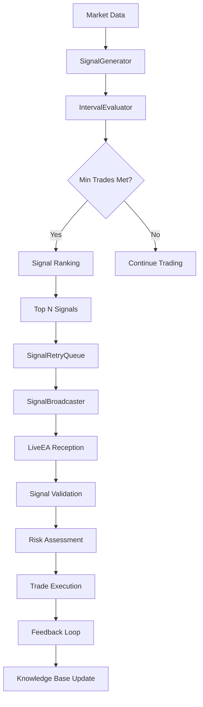

# EscapeEA System Architecture Documentation

## 🏗️ **ARCHITECTURAL OVERVIEW**

EscapeEA is a dual-Expert Advisor system implementing a sophisticated time-based learning mechanism with shared knowledge base and robust signal processing pipeline.

## 🎯 **CORE COMPONENTS**

### 1. Paper Trading EA (`PaperEA/PaperEA.mq5`)
**Purpose**: Signal generation and virtual trading in demo environment

**Key Features**:
- Time-based interval evaluation (15-minute default)
- Minimum trade threshold enforcement (10 trades/interval)
- Top-N signal selection and ranking
- Virtual balance management
- Signal broadcasting to Live EA

**Architecture**:
```
PaperEA
├── SignalGenerator (Technical analysis)
├── IntervalEvaluator (Time-based evaluation)
├── SecureKnowledgeBase (Data persistence)
├── SignalRetryQueue (Reliable delivery)
└── SignalBroadcaster (Communication)
```

### 2. Live Trading EA (`LiveEA/LiveEA.mq5`)
**Purpose**: Real trade execution based on Paper EA signals

**Key Features**:
- Signal reception and validation
- Independent signal re-evaluation
- Risk management integration
- Real money trade execution
- Feedback loop to knowledge base

**Architecture**:
```
LiveEA
├── SignalReceiver (Signal processing)
├── RiskManager (Position sizing)
├── TradeExecutor (Order management)
├── SecureKnowledgeBase (Shared data)
└── LearningEngine (Adaptation)
```

## 🔄 **DATA FLOW ARCHITECTURE**

### Signal Processing Pipeline


### Time-Based Evaluation System
```cpp
// Interval evaluation logic
class CIntervalEvaluator
{
    // Evaluates every 15 minutes (configurable)
    // Requires minimum 10 trades per interval
    // Ranks signals by performance score
    // Selects top 10 signals for broadcasting
};
```

## 🛡️ **SECURITY ARCHITECTURE**

### Multi-Layer Security Model
```
┌─────────────────────────────────────┐
│ Layer 5: Operational Security      │
│ - Signal expiration                 │
│ - Retry mechanisms                  │
│ - Performance monitoring            │
├─────────────────────────────────────┤
│ Layer 4: Data Integrity            │
│ - Checksum validation              │
│ - Corruption detection             │
│ - Recovery mechanisms              │
├─────────────────────────────────────┤
│ Layer 3: File System Security      │
│ - Exclusive file locking           │
│ - Deadlock prevention              │
│ - Concurrent access control        │
├─────────────────────────────────────┤
│ Layer 2: Resource Protection       │
│ - Memory limits                    │
│ - CPU usage bounds                 │
│ - Disk space management            │
├─────────────────────────────────────┤
│ Layer 1: Input Validation          │
│ - Data sanitization                │
│ - Type checking                    │
│ - Bounds validation                │
└─────────────────────────────────────┘
```

## 📊 **KNOWLEDGE BASE ARCHITECTURE**

### Secure Knowledge Base (`SecureKnowledgeBase.mqh`)
**Enhanced Security Features**:
- Bounds checking on all operations
- Input sanitization and validation
- Resource limit enforcement
- Integrity checking with checksums
- Automatic cleanup and maintenance

**Data Structures**:
```cpp
// Signal metadata with security validation
struct SSignalMetadata
{
    string signal_id;      // Validated format
    datetime timestamp;    // Range checked
    double confidence;     // 0.0-1.0 validated
    string symbol;         // Sanitized
    string source;         // Sanitized
    string regime;         // Sanitized
};
```

### File System Organization
```
shared_kb/
├── signals_[EA_NAME].json     # Signal history
├── trades_[EA_NAME].csv       # Trade records
├── regimes_[EA_NAME].json     # Market regimes
├── interval_logs/             # Evaluation logs
│   ├── PaperEA/
│   └── LiveEA/
└── locks/                     # File locks
    ├── signals_*.lock
    └── trades_*.lock
```

## 🔄 **COMMUNICATION ARCHITECTURE**

### Signal Broadcasting System
```cpp
// Secure signal transmission
class CSignalBroadcaster
{
    // Global variable based communication
    // Signal expiration management
    // Collision prevention
    // Status broadcasting
};
```

### Retry Queue System (`SignalRetryQueue.mqh`)
**Features**:
- Persistent signal storage
- Priority-based queuing
- Exponential backoff retry
- Acknowledgment tracking
- Automatic cleanup

**Queue Management**:
```cpp
struct SQueuedSignal
{
    string signalId;           // Unique identifier
    STradeSignal signal;       // Signal data
    datetime firstAttempt;     // Initial timestamp
    int attemptCount;          // Retry counter
    int priority;              // Queue priority
    bool acknowledged;         // Delivery confirmation
};
```

## ⚡ **PERFORMANCE ARCHITECTURE**

### Optimization Strategies
1. **Caching**: Frequently accessed data cached with TTL
2. **Batching**: Operations grouped for efficiency
3. **Lazy Loading**: Data loaded on demand
4. **Resource Pooling**: Reuse of expensive objects
5. **Asynchronous Processing**: Non-blocking operations

### Performance Metrics
```cpp
// Real-time performance monitoring
struct SPerformanceMetrics
{
    datetime startTime;
    datetime endTime;
    int operationsCompleted;
    int operationsFailed;
    double avgResponseTime;
    double maxResponseTime;
    long memoryUsed;
};
```

## 🧪 **TESTING ARCHITECTURE**

### Test Framework Structure
```
Tests/
├── Unit/                      # Component testing
│   ├── TestBase.mqh          # Base test class
│   ├── TestTradeExecutor.mq5 # Trade execution tests
│   ├── TestSignalGenerator.mq5 # Signal generation tests
│   └── TestKnowledgeBase.mq5 # Data persistence tests
├── Integration/               # System integration
│   ├── TestSignalToTradeFlow.mq5
│   └── TestPaperToLiveIntegration.mq5
├── Security/                  # Security validation
│   └── SecurityTestSuite.mq5 # Comprehensive security tests
└── Performance/               # Performance validation
    └── StressTestSuite.mq5   # Load and stress tests
```

### Test Coverage Matrix
| Component | Unit Tests | Integration Tests | Security Tests | Performance Tests |
|-----------|------------|-------------------|----------------|-------------------|
| TradeExecutor | ✅ | ✅ | ✅ | ✅ |
| SignalGenerator | ✅ | ✅ | ✅ | ✅ |
| KnowledgeBase | ✅ | ✅ | ✅ | ✅ |
| IntervalEvaluator | ✅ | ✅ | ✅ | ✅ |
| SignalRetryQueue | ✅ | ✅ | ✅ | ✅ |
| FileLockManager | ✅ | ❌ | ✅ | ✅ |
| IntegrityChecker | ✅ | ❌ | ✅ | ✅ |

## 🔧 **CONFIGURATION ARCHITECTURE**

### Environment-Specific Settings
```cpp
// Development settings
#ifdef DEVELOPMENT
    #define MAX_SIGNALS_PER_FILE 1000
    #define EVALUATION_INTERVAL 1      // 1 minute for testing
    #define MIN_TRADES_PER_INTERVAL 5
#endif

// Production settings
#ifdef PRODUCTION
    #define MAX_SIGNALS_PER_FILE 5000
    #define EVALUATION_INTERVAL 15     // 15 minutes
    #define MIN_TRADES_PER_INTERVAL 10
#endif
```

### Runtime Configuration
- Input parameters with validation
- Dynamic adjustment capabilities
- Configuration persistence
- Hot-reload support (limited)

## 📈 **SCALABILITY ARCHITECTURE**

### Horizontal Scaling
- Multiple EA instances supported
- Shared knowledge base architecture
- Load balancing through queue management
- Resource isolation between instances

### Vertical Scaling
- Memory usage optimization
- CPU-efficient algorithms
- I/O operation batching
- Resource limit enforcement

## 🔄 **DEPLOYMENT ARCHITECTURE**

### Installation Process
1. **File Deployment**: Copy all components to MQL5 directories
2. **Compilation**: Compile all components and tests
3. **Configuration**: Set environment-specific parameters
4. **Validation**: Run comprehensive test suite
5. **Monitoring**: Enable logging and performance tracking

### Production Deployment
```
Production Environment
├── MetaTrader 5 Demo (Paper EA)
├── MetaTrader 5 Live (Live EA)
├── Shared Knowledge Base (Network drive)
├── Monitoring System (Logs analysis)
└── Backup System (Data protection)
```

## 🔍 **MONITORING ARCHITECTURE**

### Real-Time Monitoring
- Performance metrics collection
- Error rate tracking
- Resource usage monitoring
- Security event detection

### Alerting System
- Threshold-based alerts
- Anomaly detection
- Escalation procedures
- Automated responses

## 🚀 **FUTURE ARCHITECTURE**

### Planned Enhancements
1. **Microservices**: Component separation
2. **API Gateway**: External integration
3. **Message Queue**: Asynchronous communication
4. **Machine Learning**: Advanced pattern recognition
5. **Cloud Integration**: Scalable infrastructure

### Technology Roadmap
- **Phase 1**: Current implementation (Complete)
- **Phase 2**: Enhanced ML integration (Q2 2025)
- **Phase 3**: Cloud deployment (Q3 2025)
- **Phase 4**: Microservices architecture (Q4 2025)

---

**Document Version**: 2.0  
**Last Updated**: 2025-01-04  
**Architecture Review**: 2025-02-04  
**Classification**: Technical Documentation