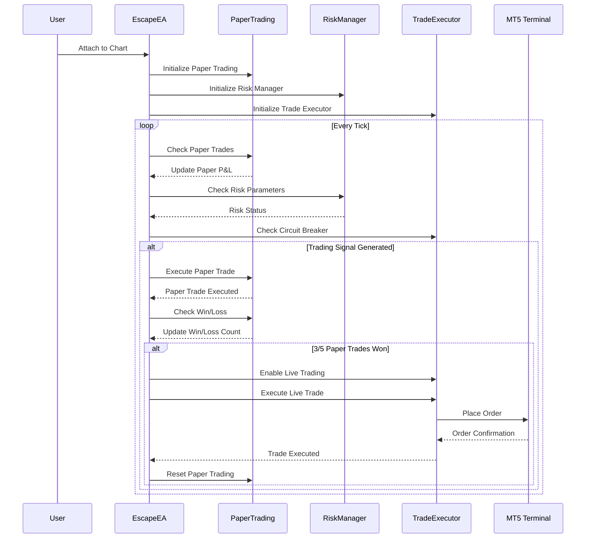
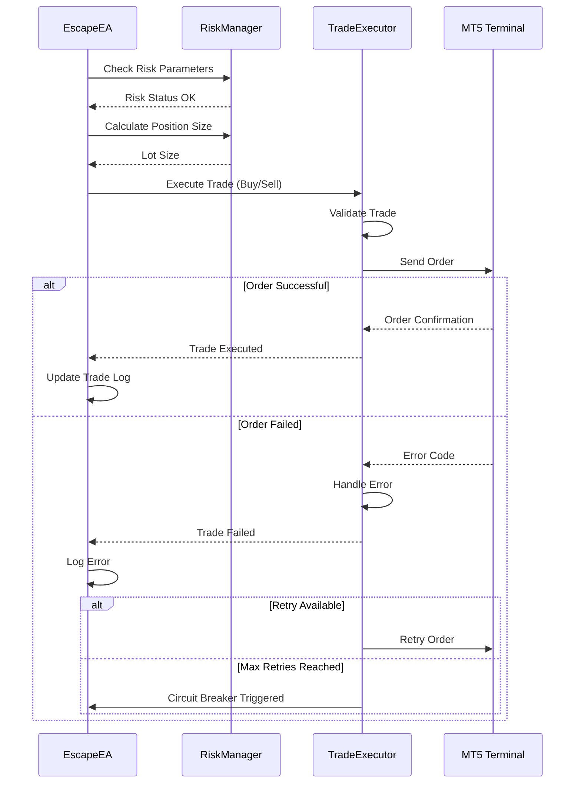
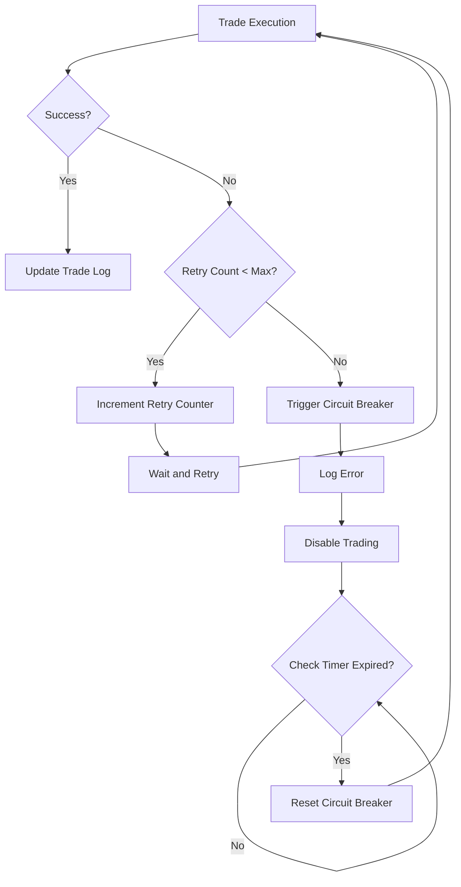
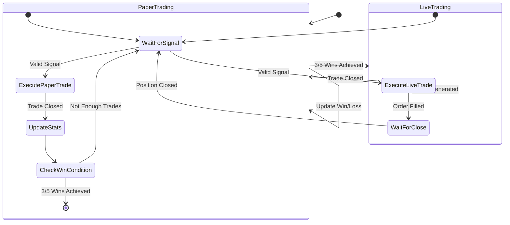
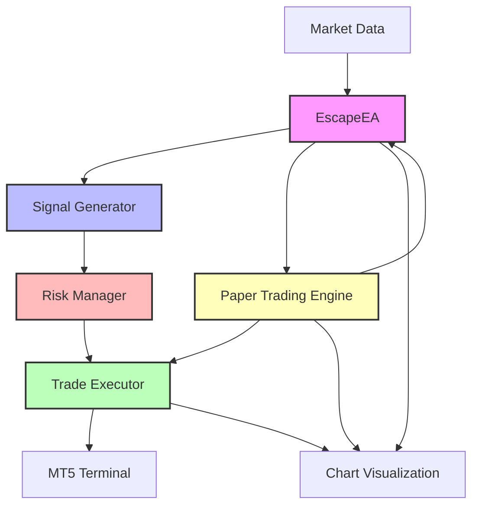

# EscapeEA Trading Sequence

## Paper Trading to Live Trading Cycle

## Order Execution Flow

## Error Handling Flow

## Paper Trading State Machine

## Component Interaction

## Notes

1. The paper trading system requires 3 out of 5 winning trades before enabling live trading
2. After each live trade, the system returns to paper trading mode
3. All trades (paper and live) are visually represented on the chart
4. The system includes comprehensive error handling and circuit breakers
5. Risk management is applied to both paper and live trades
6. The state is maintained between restarts using global variables

escape_ib/
│
├── config/                      # Configuration files
│   ├── __init__.py
│   ├── config.ini               # Main configuration
│   └── ib_config.json           # IB-specific settings
│
├── data/                        # Data storage
│   ├── __init__.py
│   ├── database.py              # SQLite database interface
│   └── models.py                # Database models
│
├── ib_client/                   # IB API interaction
│   ├── __init__.py
│   ├── client.py                # Main IB client
│   ├── data_handler.py          # Market data handling
│   ├── order_manager.py         # Order execution
│   └── contract_manager.py      # Contract definitions
│
├── strategy/                    # Trading strategies
│   ├── __init__.py
│   ├── base_strategy.py         # Base strategy class
│   └── escape_strategy.py       # Our specific strategy
│
├── learning/                    # Adaptive learning components
│   ├── __init__.py
│   ├── adaptive_engine.py       # Learning logic
│   ├── statistics.py            # Trade statistics
│   └── risk_manager.py          # Risk management
│
├── utils/                       # Utility functions
│   ├── __init__.py
│   ├── logger.py                # Logging configuration
│   ├── helpers.py               # Helper functions
│   └── constants.py             # Global constants
│
├── tests/                       # Unit tests
│   ├── __init__.py
│   ├── test_strategy.py
│   └── test_ib_client.py
│
├── .gitignore                   # Git ignore file
├── requirements.txt             # Python dependencies
├── README.md                    # Project documentation
└── main.py                      # Main application entry point