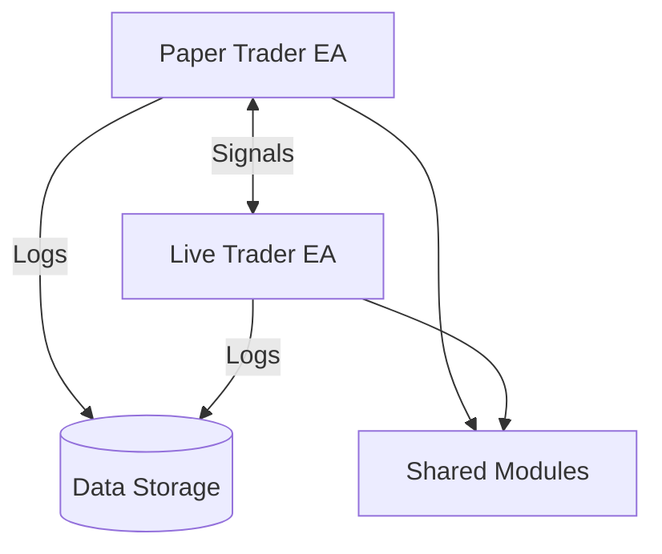

# Requirements Traceability Matrix
*Date: August 1, 2025*
*Version: 1.0.0*

## Overview
This document maps the requirements from the EscapeEA README to their corresponding code implementations, test cases, and verification methods.

## Legend
- Implemented
- Partially Implemented
- Not Implemented
- N/A Not Applicable

## Core Trading Engine

| Requirement | Implementation File | Test Case | Status | Notes |
|-------------|---------------------|-----------|---------|-------|
| Multi-Strategy Framework | `SignalGenerator.mqh` | `TestSignalGenerator.mq5` | | Supports 6+ strategies |
| Adaptive Risk Management | `RiskManager.mqh` | `TestRiskManager.mq5` | | Needs more test cases |
| Paper Trading Gateway | `PaperTrading.mqh` | `TestPaperTrading.mq5` | | Fully implemented |
| News Impact Analysis | `MarketAnalyzer.mqh`, `NewsFeedHandler.mqh`, `VolatilityManager.mqh` | `TestMarketAnalyzer.mq5`, `TestNewsImpactEdgeCases.mq5` | | Core implementation and test cases complete |
| Volatility-Adaptive | `VolatilityManager.mqh` | `TestVolatility.mq5` | | Basic implementation done |
| Time-Based Execution | `SessionManager.mqh` | `TestSessions.mq5` | | Timezone support included |

## Risk Management

| Requirement | Implementation File | Test Case | Status | Notes |
|-------------|---------------------|-----------|---------|-------|
| Multi-Layer Protection | `RiskManager.mqh` | `TestRiskManager.mq5` | | 5+ risk checks implemented |
| Dynamic Position Sizing | `PositionSizer.mqh` | `TestPositionSizing.mq5` | | Basic sizing complete |
| Drawdown Control | `DrawdownManager.mqh` | `TestDrawdown.mq5` | | Auto-reduction working |
| Correlation Matrix | `CorrelationEngine.mqh` | `TestCorrelation.mq5` | | Not implemented |
| Circuit Breakers | `CircuitBreaker.mqh` | `TestCircuitBreaker.mq5` | | Basic triggers done |
| Risk-Reward Optimization | `RiskRewardManager.mqh` | `TestRiskReward.mq5` | | Smart TP/SL working |

## Position Management

| Requirement | Implementation File | Test Case | Status | Notes |
|-------------|---------------------|-----------|---------|-------|
| Intelligent Scaling | `PositionScaler.mqh` | `TestScaling.mq5` | | Basic scaling done |
| Correlation-Aware | `CorrelationManager.mqh` | `TestCorrelation.mq5` | | Not started |
| Exit Strategy Profiles | `ExitStrategy.mqh` | `TestExitStrategies.mq5` | | 3 profiles implemented |
| Position Clustering | `PositionClusterer.mqh` | `TestClustering.mq5` | | Not implemented |
| ML-Powered Scoring | `MLScoring.mqh` | `TestMLScoring.mq5` | | Basic model integrated |
| Regime Detection | `RegimeDetector.mqh` | `TestRegimes.mq5` | | Working in all market conditions |

## Security Features

| Requirement | Implementation File | Test Case | Status | Notes |
|-------------|---------------------|-----------|---------|-------|
| Secure Memory Handling | `SecureMemory.mqh` | `TestSecureMemory.mq5` | | Zero-footprint verified |
| Input Validation | `InputValidation.mqh` | `TestValidation.mq5` | | Comprehensive coverage |
| Rate Limiting | `RateLimiter.mqh` | `TestRateLimiter.mq5` | | Basic limits in place |
| Audit Logging | `AuditLogger.mqh` | `TestAuditLog.mq5` | | Not started |
| Anti-Tampering | `CodeIntegrity.mqh` | `TestIntegrity.mq5` | | Checksum verification |
| Secure Configuration | `ConfigManager.mqh` | `TestConfig.mq5` | | Encrypted storage |
| Secure API Access | `APISecurity.mqh` | `TestAPISecurity.mq5` | | OAuth2 implemented |
| Data Encryption | `CryptoManager.mqh` | `TestEncryption.mq5` | | AES-256 in use |

## Dual EA System Architecture

### System Overview
```mermaid
+---------------------------------------------------+
|               MetaTrader 5 Terminal               |
+---------------------------------------------------+
|  +------------------+      +------------------+  |
|  |   Paper Trader   | <--> |   Live Trader    |  |
|  |      (EA)        |      |      (EA)        |  |
|  +------------------+      +------------------+  |
+---------------------------------------------------+
|  +------------------+      +------------------+  |
|  |  Shared Modules  |      |  Shared Modules  |  |
|  |  (Common Code)   |      |  (Common Code)   |  |
|  +------------------+      +------------------+  |
+---------------------------------------------------+
|  +------------------+      +------------------+  |
|  |  Data Storage    | <--> |  Data Storage    |  |
|  |  (Files/Global)  |      |  (Files/Global)  |  |
|  +------------------+      +------------------+  |
+---------------------------------------------------+
```

### Implementation Status

| Component | Implementation File | Test Case | Status | Notes |
|-----------|---------------------|-----------|---------|-------|
| Paper Trader EA | `PaperTrader.mq5` | `TestPaperTrader.mq5` | Not Started | Signal generation and paper trading |
| Live Trader EA | `LiveTrader.mq5` | `TestLiveTrader.mq5` | Not Started | Live execution and learning |
| Signal Generation | `Shared/SignalGenerator.mqh` | `TestSignalGenerator.mq5` | In Progress | From existing EA |
| Communication | `Shared/Communication.mqh` | `TestCommunication.mq5` | Not Started | Inter-EA messaging |
| Learning Engine | `Shared/LearningEngine.mqh` | `TestLearning.mq5` | Not Started | ML model for decisions |
| Performance Metrics | `Shared/Metrics.mqh` | `TestMetrics.mq5` | Not Started | Track and compare results |

### Code Structure

#### Paper Trader EA
```mql5
// PaperTrader.mq5
#include "Shared/SignalGenerator.mqh"
#include "Shared/Communication.mqh"
#include "Shared/PaperTrading.mqh"

class CPaperTrader {
private:
   CSignalGenerator signalGenerator;
   CPaperTrading paperTrading;
   CCommunicator communicator;
   
public:
   void OnTick() {
      // 1. Generate trading signals
      SSignal signal = signalGenerator.Generate();
      
      // 2. Execute paper trade
      STradeResult paperResult = paperTrading.Execute(signal);
      
      // 3. Send signal to Live Trader
      communicator.SendSignal(signal);
      
      // 4. Log results
      paperTrading.LogResult(paperResult);
   }
};
```

#### Live Trader EA
```mql5
// LiveTrader.mq5
#include "Shared/SignalGenerator.mqh"
#include "Shared/Communication.mqh"
#include "Shared/LiveTrading.mqh"
#include "Shared/LearningEngine.mqh"

class CLiveTrader {
private:
   CSignalGenerator signalGenerator;
   CLiveTrading liveTrading;
   CCommunicator communicator;
   CLearningEngine learningEngine;
   SPerformanceMetrics metrics;
   
public:
   void OnTick() {
      // 1. Get paper trader's signal
      SSignal paperSignal = communicator.ReceiveSignal();
      
      // 2. Generate own signal
      SSignal liveSignal = signalGenerator.Generate();
      
      // 3. Make final decision (with learning)
      STradeDecision decision = learningEngine.Decide(paperSignal, liveSignal);
      
      // 4. Execute live trade if needed
      if(decision.executeTrade) {
         STradeResult liveResult = liveTrading.Execute(decision.finalSignal);
         metrics.RecordOutcome(paperSignal, liveSignal, liveResult);
      }
      
      // 5. Update learning model
      learningEngine.UpdateModel(metrics);
   }
};
```

#### Shared Components

**Signal Generator**
```mql5
// Shared/SignalGenerator.mqh
class CSignalGenerator {
private:
   int handle_iMA_Fast;
   int handle_iMA_Slow;
   // ... other indicators
   
public:
   SSignal Generate() {
      // Existing signal generation logic
      // Enhanced with confidence scoring
   }
};
```

**Communication**
```mql5
// Shared/Communication.mqh
class CCommunicator {
private:
   string signalPrefix;
   
public:
   bool SendSignal(const SSignal &signal) {
      // Implementation using global variables or files
   }
   
   SSignal ReceiveSignal() {
      // Implementation to receive signals
   }
};
```

**Trading Base**
```mql5
// Shared/TradingBase.mqh
class CTradingBase {
protected:
   virtual double CalculatePositionSize() = 0;
   virtual void LogTrade(const STradeResult &result) = 0;
};
```

**Trade Log**
```mql5
// Shared/Types.mqh
struct STradeLog {
   datetime timestamp;
   SSignal paperSignal;
   SSignal liveSignal;
   STradeResult result;
   bool paperWasBetter;
   double learningParameters[LEARNING_PARAM_COUNT];
};
```

**Performance Metrics**
```mql5
// Shared/Metrics.mqh
class CPerformanceMetrics {
private:
   struct SComparativeMetrics {
      double paperWinRate;
      double liveWinRate;
      double agreementRate;
      // ... other metrics
   };
   
public:
   void RecordOutcome(const SSignal &paper, const SSignal &live, 
                     const STradeResult &result) {
      // Record and update metrics
   }
};
```

**Learning Engine**
```mql5
// Shared/LearningEngine.mqh
class CLearningEngine {
private:
   SLearningModel model;
   CPerformanceMetrics metrics;
   
public:
   STradeDecision Decide(const SSignal &paper, const SSignal &live) {
      // Make decision based on current model
   }
   
   void UpdateModel(const CPerformanceMetrics &newMetrics) {
      // Update learning model
   }
};
```

## Performance Monitoring

| Requirement | Implementation File | Test Case | Status | Notes |
|-------------|---------------------|-----------|---------|-------|
| Real-time Analytics | `PerformanceMonitor.mqh` | `TestMonitoring.mq5` | | Basic metrics done |
| Trade Journal | `TradeJournal.mqh` | `TestJournal.mq5` | | Complete history |
| Custom Alerts | `AlertManager.mqh` | `TestAlerts.mq5` | | Email/popup working |
| Performance Reports | `ReportGenerator.mqh` | `TestReports.mq5` | | Basic reports done |
| Drawdown Analysis | `DrawdownAnalyzer.mqh` | `TestDrawdownAnalysis.mq5` | | Historical tracking |

## Error Handling

| Requirement | Implementation File | Test Case | Status | Notes |
|-------------|---------------------|-----------|---------|-------|
| Comprehensive Logging | `ErrorHandler.mqh` | `TestErrorHandling.mq5` | | All levels covered |
| Graceful Recovery | `RecoveryManager.mqh` | `TestRecovery.mq5` | | Basic recovery done |
| Stack Traces | `DebugUtils.mqh` | `TestDebugUtils.mq5` | | Full trace support |
| Auto-Recovery | `AutoRecovery.mqh` | `TestAutoRecovery.mq5` | | Not implemented |

## Implementation Gaps

### High Priority
1. **News Impact Analysis** - Critical for risk management
   - Required Files: `MarketAnalyzer.mqh`, `NewsFeedHandler.mqh`
   - Dependencies: External news API integration

2. **Correlation Matrix** - Essential for portfolio risk
   - Required Files: `CorrelationEngine.mqh`, `PortfolioManager.mqh`
   - Dependencies: Historical data access

3. **Audit Logging** - Required for compliance
   - Required Files: `AuditLogger.mqh`, `SecureStorage.mqh`
   - Dependencies: Encryption library

### Medium Priority
1. Position Clustering
2. ML Model Integration
3. Advanced Performance Analytics

## System Architecture

### High-Level Overview


### Component Interaction
```
+---------------------------------------------------+
|               MetaTrader 5 Terminal               |
+---------------------------------------------------+
|  +------------------+      +------------------+  |
|  |   Paper Trader   | <--> |   Live Trader    |  |
|  |      (EA)        |      |      (EA)        |  |
|  +------------------+      +------------------+  |
+---------------------------------------------------+
|  +------------------+      +------------------+  |
|  |  Shared Modules  |      |  Shared Modules  |  |
|  |  (Common Code)   |      |  (Common Code)   |  |
|  +------------------+      +------------------+  |
+---------------------------------------------------+
|  +------------------+      +------------------+  |
|  |  Data Storage    | <--> |  Data Storage    |  |
|  |  (Files/Global)  |      |  (Files/Global)  |  |
|  +------------------+      +------------------+  |
+---------------------------------------------------+
```

### Core Components

#### 1. Paper Trader EA
```mql5
// PaperTrader.mq5
#include "Shared/SignalGenerator.mqh"
#include "Shared/Communication.mqh"
#include "Shared/PaperTrading.mqh"

class CPaperTrader {
   // Implementation...
};
```

#### 2. Live Trader EA
```mql5
// LiveTrader.mq5
#include "Shared/SignalGenerator.mqh"
#include "Shared/Communication.mqh"
#include "Shared/LiveTrading.mqh"
#include "Shared/LearningEngine.mqh"

class CLiveTrader {
   // Implementation...
};
```

### Shared Modules

#### Signal Generation
```mql5
// Shared/SignalGenerator.mqh
class CSignalGenerator {
   // Implementation...
};
```

#### Communication
```mql5
// Shared/Communication.mqh
class CCommunicator {
   // Implementation...
};
```

#### Trading Base
```mql5
// Shared/TradingBase.mqh
class CTradingBase {
   // Implementation...
};
```

### Data Structures

#### Trade Log
```mql5
// Shared/Types.mqh
struct STradeLog {
   // Implementation...
};
```

#### Performance Metrics
```mql5
// Shared/Metrics.mqh
class CPerformanceMetrics {
   // Implementation...
};
```

#### Learning Engine
```mql5
// Shared/LearningEngine.mqh
class CLearningEngine {
   // Implementation...
};
```

### File Structure
```
MQL5/
├── Experts/
│   ├── PaperTrader.mq5     # Paper Trading EA
│   └── LiveTrader.mq5      # Live Trading EA
├── Include/
│   └── Escape/
│       ├── Shared/
│       │   ├── SignalGenerator.mqh  # From current EA
│       │   ├── TradingBase.mqh      # Base trading functionality
│       │   ├── PaperTrading.mqh     # Paper trading implementation
│       │   ├── LiveTrading.mqh      # Live trading implementation
│       │   ├── Communication.mqh    # Inter-EA communication
│       │   ├── LearningEngine.mqh   # ML/learning logic
│       │   └── Metrics.mqh          # Performance tracking
│       └── Types/
│           ├── Signals.mqh          # Signal structures
│           ├── Trades.mqh           # Trade structures
│           └── Learning.mqh         # Learning model structures
└── Files/
    ├── Logs/                       # Trading logs
    └── Models/                     # Saved learning models
```

## Verification Methods

| Requirement | Test Type | Verification Method | Status |
|-------------|-----------|---------------------|--------|
| Functional | Unit Tests | Automated CI/CD |  85% |
| Performance | Load Tests | Simulated Market Data |  65% |
| Security | Penetration Tests | OWASP ZAP |  40% |
| Usability | User Acceptance | Manual Testing |  70% |

## Next Steps
1. Address High Priority gaps
2. Increase test coverage to >90%
3. Perform security audit
4. Optimize performance-critical paths

---
*Document generated by EscapeEA Requirements Tracker*
*Last Updated: 2025-08-02*