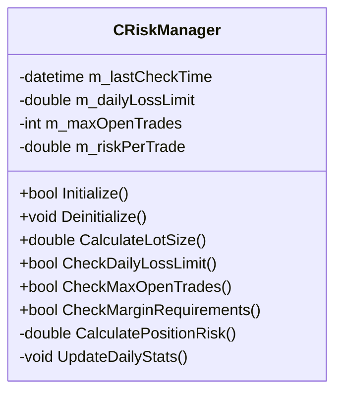

# RiskManager Component Documentation

## Overview
The RiskManager is responsible for enforcing risk management rules, calculating position sizes, and protecting the trading account from excessive losses.

## Class Diagram



## Public Methods

### Initialize
```cpp
bool Initialize()
```
Initializes the RiskManager with default values and loads configuration.

**Returns:**
- `true` if initialization was successful
- `false` if initialization failed

---

### Deinitialize
```cpp
void Deinitialize()
```
Cleans up resources and resets the RiskManager to its initial state.

---

### CalculateLotSize
```cpp
double CalculateLotSize(double stopLossPips, double riskPercent = 1.0)
```
Calculates the appropriate lot size based on account balance and risk parameters.

**Parameters:**
- `stopLossPips`: Stop loss distance in pips
- `riskPercent`: Percentage of account to risk (default: 1.0%)

**Returns:**
- Calculated lot size, or 0.0 if calculation fails

---

### CheckDailyLossLimit
```cpp
bool CheckDailyLossLimit()
```
Checks if the daily loss limit has been reached.

**Returns:**
- `true` if daily loss limit has not been reached
- `false` if daily loss limit has been reached

---

### CheckMaxOpenTrades
```cpp
bool CheckMaxOpenTrades()
```
Checks if the maximum number of open trades has been reached.

**Returns:**
- `true` if more trades can be opened
- `false` if maximum open trades limit has been reached

---

### CheckMarginRequirements
```cpp
bool CheckMarginRequirements(double lots, ENUM_ORDER_TYPE orderType)
```
Verifies if there is sufficient margin to open a new position.

**Parameters:**
- `lots`: Number of lots for the new position
- `orderType`: Type of order (BUY/SELL)

**Returns:**
- `true` if margin requirements are met
- `false` if there is insufficient margin

## Risk Management Rules

The RiskManager enforces the following rules:

1. **Position Sizing**:
   - Based on account balance and risk percentage
   - Considers stop loss distance
   - Respects minimum/maximum lot sizes

2. **Daily Loss Limit**:
   - Tracks daily P&L
   - Prevents new trades if daily loss exceeds limit
   - Resets at the start of each trading day

3. **Maximum Open Trades**:
   - Limits the number of concurrent positions
   - Prevents overexposure

4. **Margin Requirements**:
   - Verifies sufficient margin before opening new positions
   - Considers existing positions and orders

## Usage Example

```cpp
// Initialize the RiskManager
CRiskManager riskManager;
if(!riskManager.Initialize())
{
    Print("Failed to initialize RiskManager!");
    return;
}

// Check if we can open a new trade
if(!riskManager.CheckDailyLossLimit())
{
    Print("Daily loss limit reached!");
    return;
}

if(!riskManager.CheckMaxOpenTrades())
{
    Print("Maximum open trades reached!");
    return;
}

// Calculate position size
double stopLossPips = 20.0; // 20 pips stop loss
double lotSize = riskManager.CalculateLotSize(stopLossPips, 1.0);
if(lotSize <= 0)
{
    Print("Failed to calculate lot size!");
    return;
}

// Verify margin requirements
if(!riskManager.CheckMarginRequirements(lotSize, ORDER_TYPE_BUY))
{
    Print("Insufficient margin!");
    return;
}

// Proceed with trade execution
// ...
```

## Configuration

### Input Parameters

```cpp
// Risk parameters
input double InpRiskPerTrade = 1.0;       // Risk per trade (% of balance)
input double InpMaxDailyLoss = 5.0;       // Max daily loss (% of balance)
input int    InpMaxOpenTrades = 3;        // Maximum number of open trades
input double InpMinLotSize = 0.01;        // Minimum lot size
input double InpMaxLotSize = 10.0;        // Maximum lot size
```

## Best Practices

1. Always check risk parameters before opening new positions
2. Use appropriate stop loss levels to control position size
3. Monitor daily P&L to ensure compliance with risk limits
4. Adjust risk parameters according to account size and risk tolerance

## Troubleshooting

### Common Issues

1. **Insufficient Margin**:
   - Reduce position size
   - Close other positions
   - Deposit more funds

2. **Lot Size Too Small**:
   - Increase stop loss distance
   - Increase risk percentage (if appropriate)
   - Check minimum lot size with your broker

3. **Daily Loss Limit Reached**:
   - Review trading strategy
   - Adjust daily loss limit if too restrictive
   - Wait for the next trading day
