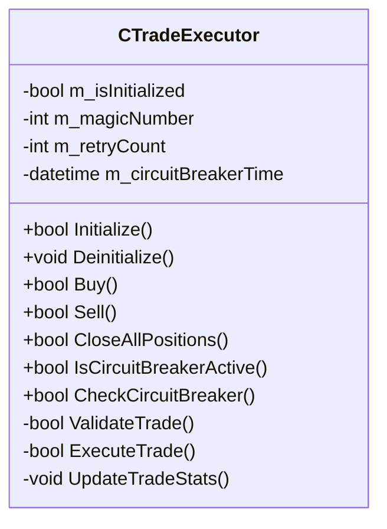

# TradeExecutor Component Documentation

## Overview
The TradeExecutor is the core component responsible for executing trades with safety checks, retry logic, and circuit breaker patterns to ensure reliable trade execution.

## Class Diagram



## Public Methods

### Initialize
```cpp
bool Initialize()
```
Initializes the TradeExecutor with default values and performs system checks.

**Returns:**
- `true` if initialization was successful
- `false` if initialization failed

---

### Deinitialize
```cpp
void Deinitialize()
```
Cleans up resources and resets the TradeExecutor to its initial state.

---

### Buy
```cpp
bool Buy(double volume, double stopLoss = 0, double takeProfit = 0, string comment = "")
```
Executes a buy order with the specified parameters.

**Parameters:**
- `volume`: Trade volume in lots
- `stopLoss`: Stop loss price (0 = no stop loss)
- `takeProfit`: Take profit price (0 = no take profit)
- `comment`: Trade comment

**Returns:**
- `true` if the order was placed successfully
- `false` if the order failed

---

## Unified Order Validation

All order validation is now performed exclusively via the `ValidateOrder` method. This function consolidates all previous validation logic (including what was in `ValidateOrderRequest` and `ValidateRequest`) and leverages `CInputValidator` for robust, consistent, and traceable validation of all input parameters and trade conditions.

**Key Points:**
- No other validation functions should be called for order execution.
- All input checks (symbol, volume, price, stops, magic, slippage, comment) are handled by `ValidateOrder`.
- `CInputValidator` is used internally for all parameter checks, ensuring maintainability and extensibility.
- Error messages and traceability are improved for debugging and audit.

**Usage Example:**
```cpp
if(!ValidateOrder(symbol, type, volume, price, sl, tp, magic, slippage, comment)) {
    Print("Order validation failed: ", GetLastError());
    return false;
}
```

### Sell
```cpp
bool Sell(double volume, double stopLoss = 0, double takeProfit = 0, string comment = "")
```
Executes a sell order with the specified parameters.

**Parameters:**
- `volume`: Trade volume in lots
- `stopLoss`: Stop loss price (0 = no stop loss)
- `takeProfit`: Take profit price (0 = no take profit)
- `comment`: Trade comment

**Returns:**
- `true` if the order was placed successfully
- `false` if the order failed

---

### CloseAllPositions
```cpp
bool CloseAllPositions()
```
Closes all open positions for the current symbol and magic number.

**Returns:**
- `true` if all positions were closed successfully
- `false` if any position failed to close

---

### IsCircuitBreakerActive
```cpp
bool IsCircuitBreakerActive()
```
Checks if the circuit breaker is currently active.

**Returns:**
- `true` if the circuit breaker is active
- `false` otherwise

---

### CheckCircuitBreaker
```cpp
bool CheckCircuitBreaker()
```
Checks if the circuit breaker can be reset.

**Returns:**
- `true` if the circuit breaker was reset
- `false` if it's still too early to reset

## Error Handling

The TradeExecutor implements several error handling mechanisms:

1. **Input Validation**: All input parameters are validated before processing using the unified `ValidateOrder` method, which integrates CInputValidator for comprehensive checks. All previous validation methods (ValidateOrderRequest, ValidateRequest) are deprecated and removed. See the new section below for details.
2. **Retry Logic**: Failed trade attempts are automatically retried (configurable)
3. **Circuit Breaker**: Automatically pauses trading after multiple failures
4. **Error Logging**: Detailed error messages are logged for debugging

## Usage Example

```cpp
// Initialize the TradeExecutor
CTradeExecutor executor;
if(!executor.Initialize())
{
    Print("Failed to initialize TradeExecutor!");
    return;
}

// Execute a buy order
double volume = 0.1;
double stopLoss = 1.2000;
double takeProfit = 1.2100;

if(executor.Buy(volume, stopLoss, takeProfit, "Trend Following Buy"))
{
    Print("Buy order placed successfully!");
}
else
{
    Print("Failed to place buy order!");
}
```

## Best Practices

1. Always check the return value of trade execution methods
2. Implement proper error handling for trade execution failures
3. Monitor the circuit breaker status to prevent excessive failed trades
4. Use appropriate logging levels for different types of messages

## Troubleshooting

### Common Issues

1. **Order Rejections**: Check account balance, margin requirements, and trading permissions
2. **Invalid Stops/Targets**: Ensure stop loss and take profit levels are valid for the current price
3. **Circuit Breaker Activation**: Review logs to identify the cause of multiple trade failures

## Performance Considerations

- The TradeExecutor is optimized for low-latency execution
- Circuit breaker checks add minimal overhead
- Logging can be adjusted based on performance requirements
